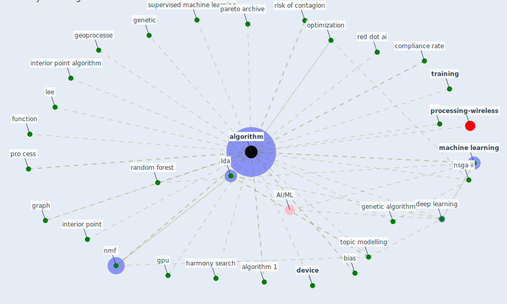

# Keyword: algorithm

* [processing-wireless](cluster_14)

## Keywords

 * Cluster_14, airflow pattern, [algorithm](keyword_algorithm), algorithm 1, an swer, bias, box constrain optimization problem, carrier scheduling, circle pack algorithm, classification, [clinical](keyword_clinical), cluster, cluster algorithm, complex, complex algorithm, compliance rate, computational, conjugate gradient, conjugate gradient algorithm, cosip, covid net, ct image, datum mining, datum point, [deep learning](keyword_deep_learning), [device](keyword_device), function, genetic, genetic algorithm, geoprocesse, go, gpu, graph, harmony search, interior point, interior point algorithm, [lda](keyword_lda), lee, [machine learning](keyword_machine_learning), metaheuristic, modularity optimization, nmf, nondominate solution, nsga, nsga ii, nsga ii algorithm, [occupant](keyword_occupant), occupant 2 1, okawarunmf, open source, opti mization problem, optimization, optimization algorithm, [optimization problem](keyword_optimization_problem), optimization process, optimize, optimize arrangement, parallel, [parameter](keyword_parameter), pareto archive, popu lation size, population count crossover, population count crossover proportion, pro cess, pseudocode, pseudocode of the propose algorithm, question selection algorithm, random forest, recognize, red dot, red dot ai, risk of contagion, risk scaled, robust statistic, s function, seed, self calibration, self calibration algorithm, short path routing, [simulation](keyword_simulation), [smart contract](keyword_smart_contract), snopt, sort track, source code, statistic, supervised machine learning, [system](keyword_system), temperature checking, testing, topic model algorithm, [topic modelling](keyword_topic_modelling), [training](keyword_training), trust region reflective least square, trustregion, trustregion reflective algorithm, un supervise machine learning, unsupervised, unsupervised method, vuno, vuno s chest x ray image support decision tool

## Mapping

## Neighbours

### Closest articles

* Social distancing enhanced automated optimal design of physical spaces in the wake of the COVID-19 pandemic - [LINK](article_ugail_social_2021)
* Exploring the Non-Medical impacts of Covid-19 using Natural Language Processing - [LINK](article_agade_exploring_2020)
* The effect of occupant distribution on energy consumption and COVID-19 infection in buildings: A case study of university building - [LINK](article_mokhtari_effect_2021)
* A Comprehensive Review of the COVID-19 Pandemic and the Role of IoT, Drones, AI, Blockchain, and 5G in Managing its Impact - [LINK](article_chamola_comprehensive_2020)
* Towards the sustainable development of smart cities through mass video surveillance: A response to the COVID-19 pandemic - [LINK](article_shorfuzzaman_towards_2021)
* Mitigation strategies and compliance in the COVID-19 fight; how much compliance is enough? - [LINK](article_mukerjee_mitigation_2021)
* How loneliness is talked about in social media during COVID-19 pandemic: Text mining of 4,492 Twitter feeds - [LINK](article_koh_how_2022)
* World Bank Development Report - [LINK](article_world_bank_world_2022)
* COVID19-Routes: A Safe Pedestrian Navigation Service - [LINK](article_cantarero_covid19-routes_2021)
* CIDO, a community-based ontology for coronavirus disease knowledge and data integration, sharing, and analysis - [LINK](article_he_cido_2020)

### Closest BPs

