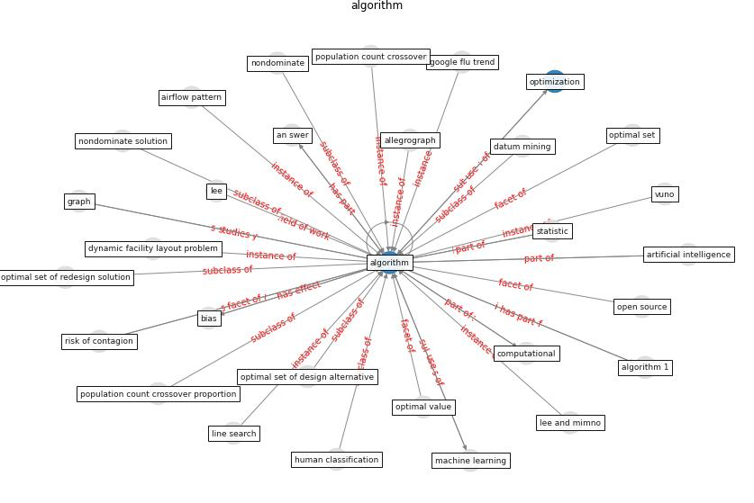

# Keyword: __algorithm__
## Clusters

* Cluster 0: [energy-building](cluster_0)

## Concepts

 

## Top 10 articles for __algorithm__
* Social distancing enhanced automated optimal design of
physical spaces in the wake of the COVID-19 pandemic ([ugail_social_2021](article_ugail_social_2021))
* The effect of occupant distribution on energy consumption
and COVID-19 infection in buildings: A case study of
university building ([mokhtari_effect_2021](article_mokhtari_effect_2021))
* A Comprehensive Review of the COVID-19 Pandemic
and the Role of IoT, Drones, AI, Blockchain, and
5G in Managing its Impact ([chamola_comprehensive_2020](article_chamola_comprehensive_2020))
* Mobile Technology Solution for COVID-19:
Surveillance and Prevention ([raza_mobile_2021](article_raza_mobile_2021))
* How loneliness is talked about in social media during
COVID-19 pandemic: Text mining of 4,492 Twitter
feeds ([koh_how_2022](article_koh_how_2022))
* world_bank_world_2022 ([world_bank_world_2022](article_world_bank_world_2022))
* Pandemic Analytics: How Countries are Leveraging
Big Data Analytics and Artificial Intelligence to
Fight COVID-19? ([mehta_pandemic_2021](article_mehta_pandemic_2021))
* COVID19-Routes: A Safe Pedestrian Navigation
Service ([cantarero_covid19-routes_2021](article_cantarero_covid19-routes_2021))
* CIDO, a community-based ontology for coronavirus disease
knowledge and data integration, sharing, and analysis ([he_cido_2020](article_he_cido_2020))
* council_of_europe_2020_2020 ([council_of_europe_2020_2020](article_council_of_europe_2020_2020))
