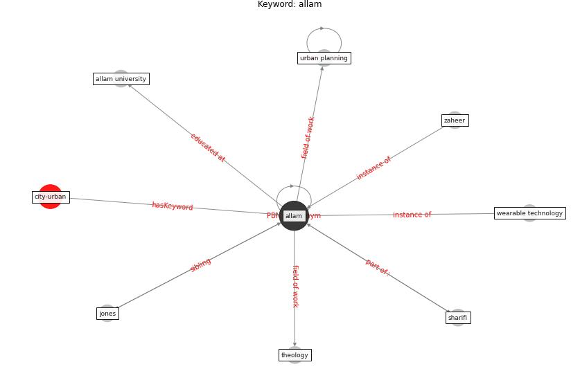

# Keyword: __allam__
## Clusters

* Cluster 4: [smart-city](cluster_4)
* Cluster 10: [city-smart](cluster_10)

## Concepts

 

## Top 10 articles for __allam__
* On the Coronavirus (COVID-19) Outbreak and the
Smart City Network: Universal Data Sharing
Standards Coupled with Artificial Intelligence
(AI) to Benefit Urban Health Monitoring and
Management ([allam_coronavirus_2020](article_allam_coronavirus_2020))
* afrin_covid-19_2021 ([afrin_covid-19_2021](article_afrin_covid-19_2021))
* Pandemic stricken cities on lockdown. Where are our
planning and design professionals [now, then and into the
future]? ([allam_pandemic_2020](article_allam_pandemic_2020))
* Exploring the Non-Medical impacts of Covid-19 using
Natural Language Processing ([agade_exploring_2020](article_agade_exploring_2020))
* Contributions of Smart City Solutions and
Technologies to Resilience against the COVID-19
Pandemic: A Literature Review ([sharifi_contributions_2021](article_sharifi_contributions_2021))
* Antivirus-built environment: Lessons learned from
Covid-19 pandemic ([megahed_antivirus-built_2020](article_megahed_antivirus-built_2020))
