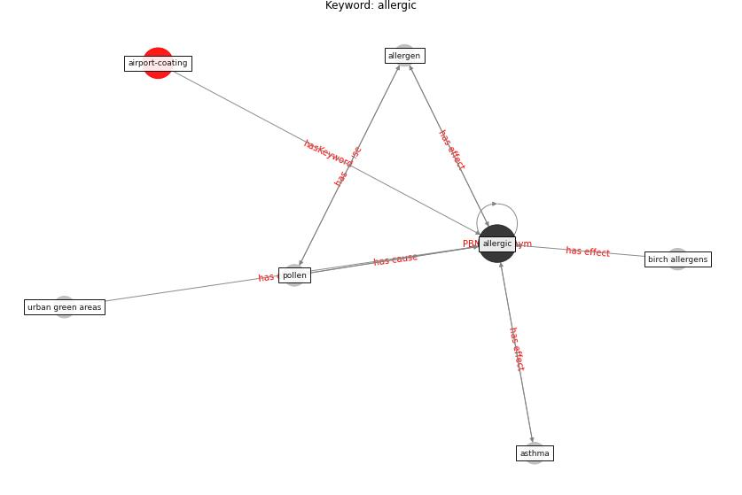

# Keyword: allergic

* [airport-coating](cluster_Cluster_6)

## Keywords

 * Cluster_6, allergen, [allergic](keyword_allergic), asthma, birch allergens, [pollen](keyword_pollen), urban green areas

## Concepts

 

## Neighbours

### Closest articles

* Making green infrastructure healthier infrastructure - [LINK](article_lohmus_making_2015)
* Ten questions concerning occupant health in buildings during normal operations and extreme events including the COVID-19 pandemic - [LINK](article_awada_ten_2021)
* Perception of COVID-19 impacts on the construction industry over time - [LINK](article_rokooei_perception_2022)
* A comprehensive review on indoor air quality monitoring systems for enhanced public health - [LINK](article_saini_comprehensive_2020)

### Closest BPs

