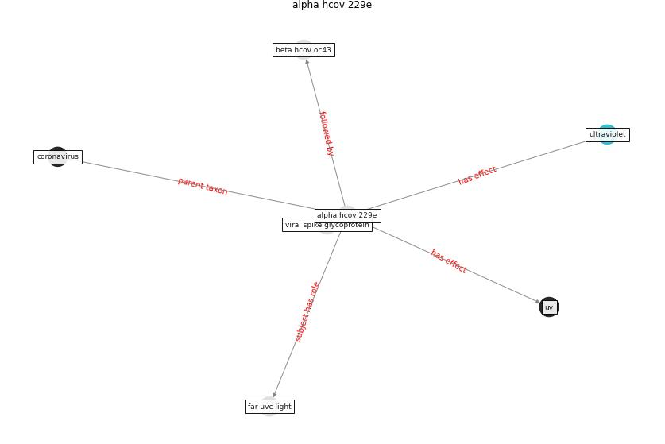

# Keyword: __alpha hcov 229e__

## Concepts

 

## Top articles for __alpha hcov 229e__
* Far-UVC light (222 nm) efficiently and safely
inactivates airborne human coronaviruses ([buonanno_far-uvc_2020](article_buonanno_far-uvc_2020))
