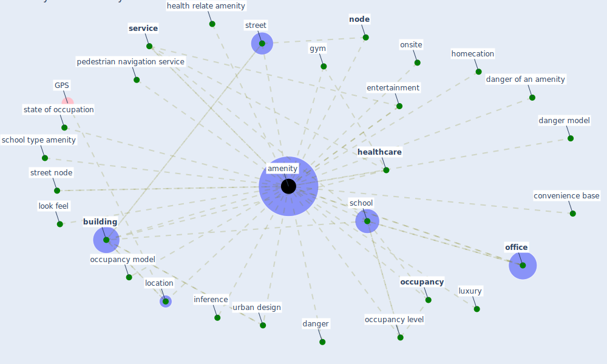

# Keyword: amenity

## Keywords

 * amenities, [amenity](keyword_amenity), amenity location, [build](keyword_build), [building](keyword_building), building location, convenience, convenience base, danger, [danger model](keyword_danger_model), danger of an amenity, entertainment, gym, health relate amenity, [healthcare](keyword_healthcare), homecation, inference, level of danger, location, look feel, luxury, [node](keyword_node), [occupancy](keyword_occupancy), occupancy level, occupancy model, [office](keyword_office), onsite, pedestrian navigation service, [school](keyword_school), school type amenity, [service](keyword_service), state of occupation, street, street node, urban design

## Mapping

## Neighbours

### Closest articles

* COVID19-Routes: A Safe Pedestrian Navigation Service - [LINK](article_cantarero_covid19-routes_2021)
* Health, Wellbeing \& Productivity in Offices - [LINK](article_world_green_building_council_health_2014)
* COVID-19 and Green Housing: A Review of Relevant Literature - [LINK](article_kaklauskas_covid-19_2021)
* Respiratory pandemics, urban planning and design: A multidisciplinary rapid review of the literature - [LINK](article_harris_respiratory_2022)
* Urban planning after COVID-19 - [LINK](article_rtpi_urban_2021)

### Closest BPs

