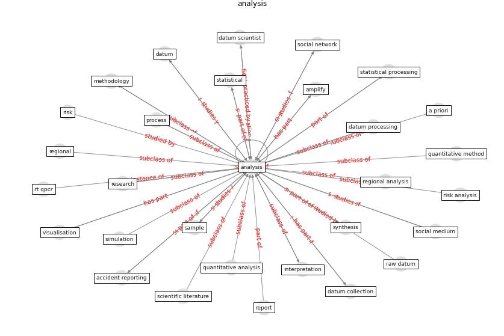

# Keyword: __analysis__
## Clusters

* Cluster 14: [resilience-system](cluster_14)

## Concepts

 

## Top 10 articles for __analysis__
* oecd_guidelines_2014 ([oecd_guidelines_2014](article_oecd_guidelines_2014))
* A Global Survey of Infection Control and
Mitigation Measures for Combating the Transmission
of COVID-19 Pandemic in Buildings Under
Facilities Management Services ([sarvari_global_2022](article_sarvari_global_2022))
* A Global Survey of Infection Control and
Mitigation Measures for Combating the Transmission
of COVID-19 Pandemic in Buildings Under
Facilities Management Services ([sarvari_global_2022](article_sarvari_global_2022))
* The Impact of Pandemic Crisis on the Survival of
Construction Industry: A Case of COVID-19 ([gamil_impact_2020](article_gamil_impact_2020))
* Occupant health in buildings: Impact of the COVID-19
pandemic on the opinions of building professionals and
implications on research ([awada_occupant_2022](article_awada_occupant_2022))
* Management of the COVID-19 pandemic: challenges,
practices, and organizational support ([hossny_management_2022](article_hossny_management_2022))
* Scalable IoT Architecture for Monitoring IEQ
Conditions in Public and Private Buildings ([calvo_scalable_2022](article_calvo_scalable_2022))
* Exploring the Non-Medical impacts of Covid-19 using
Natural Language Processing ([agade_exploring_2020](article_agade_exploring_2020))
* COVID-19 and Green Housing: A Review of
Relevant Literature ([kaklauskas_covid-19_2021](article_kaklauskas_covid-19_2021))
* Impact of COVID-19 on IoT Adoption in Healthcare,
Smart Homes, Smart Buildings, Smart Cities,
Transportation and Industrial IoT ([umair_impact_2021](article_umair_impact_2021))
