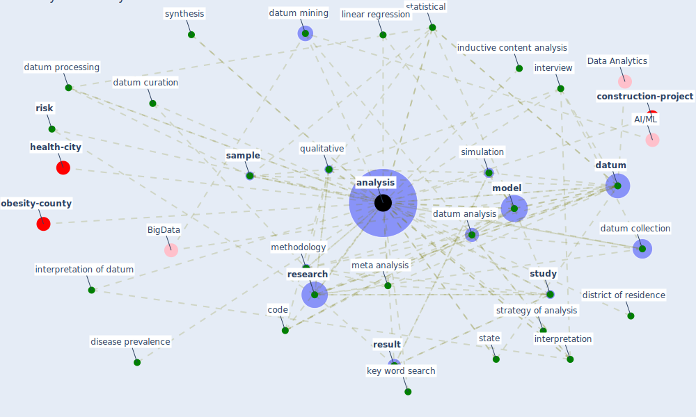

# Keyword: analysis

* [resilience-infrastructure](cluster_11)

## Keywords

 * Cluster_11, accident reporting, [analysis](keyword_analysis), bda, code, confound factor, [control](keyword_control), [datum](keyword_datum), datum analysis, datum collection, datum curation, datum mining, datum processing, datum scientist, decision make, [design](keyword_design), diagnosis, diagnostic, disaggregate trade datum, disease prevalence, district of residence, double check, draft preparation, harmonisation, hmi, inductive content analysis, inferential, interpretation, interpretation of datum, interview, investment style analysis, key control, key word search, linear regression, literature review, macro scale, matrix, mechanism, meso scale, [meta analysis](keyword_meta_analysis), methodology, [model](keyword_model), [monitor](keyword_monitor), [network](keyword_network), [noise](keyword_noise), [oecd](keyword_oecd), [plan](keyword_plan), pls analysis, policy analysis, preliminary test, probability, [process](keyword_process), processing, programming, [qualitative](keyword_qualitative), quantitative, quantitative analysis, quantitative method, raw datum, regional, report, [research](keyword_research), result, result analysis, [risk](keyword_risk), risk analysis, rt qpcr, [sample](keyword_sample), scientific literature, [simulation](keyword_simulation), [stakeholder](keyword_stakeholder), standardization, [state](keyword_state), statis tical, statistical, storage, strategy of analysis, [study](keyword_study), style, sub theme, [survey](keyword_survey), survey datum, swot, synthesis, synthesis process, sys sn, thematic, theory of change, transcribe, two mechanism, typologie, uncontrolle, uncontrolled analysis, understand, univariate, virus modeling, visualisation, visualization, voice sample, wastewater treatment facility

## Mapping

## Neighbours

### Closest articles

* Guidelines for resilience systems analysis - [LINK](article_oecd_guidelines_2014)
* Occupant health in buildings: Impact of the COVID-19 pandemic on the opinions of building professionals and implications on research - [LINK](article_awada_occupant_2022)
* The Impact of Pandemic Crisis on the Survival of Construction Industry: A Case of COVID-19 - [LINK](article_gamil_impact_2020)
* Management of the COVID-19 pandemic: challenges, practices, and organizational support - [LINK](article_hossny_management_2022)
* Scalable IoT Architecture for Monitoring IEQ Conditions in Public and Private Buildings - [LINK](article_calvo_scalable_2022)
* A Global Survey of Infection Control and Mitigation Measures for Combating the Transmission of COVID-19 Pandemic in Buildings Under Facilities Management Services - [LINK](article_sarvari_global_2022)
* The role of green roofs in post COVID-19 confinement: An analysis of willingness to pay - [LINK](article_manso_role_2021)
* COVID-19 and Green Housing: A Review of Relevant Literature - [LINK](article_kaklauskas_covid-19_2021)
* Covid-19 and asset management in EU: a preliminary assessment of performance and investment styles - [LINK](article_rizvi_covid-19_2020)
* The impact of the COVID-19 pandemic on the importance of urban green spaces to the public - [LINK](article_noszczyk_impact_2022)

### Closest BPs

