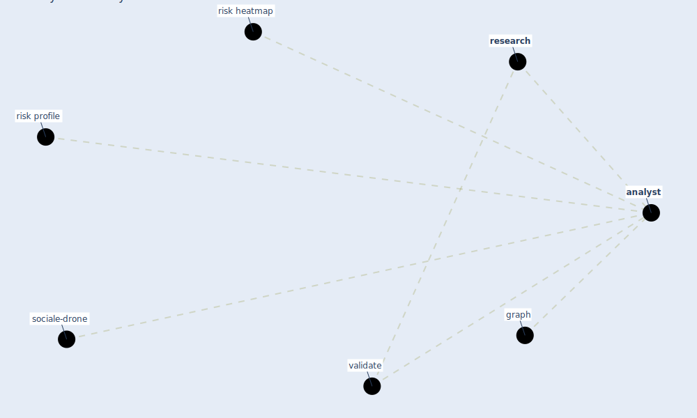

# Keyword: analyst

* [sociale-drone](cluster_6)

## Keywords

 * Cluster_6, [analyst](keyword_analyst), analysts, graph, [research](keyword_research), risk heatmap, risk profile, validate

## Mapping

## Neighbours

### Closest articles

* Guidelines for resilience systems analysis - [LINK](article_oecd_guidelines_2014)
* Digital Twin of COVID-19 Mass Vaccination Centers - [LINK](article_pilati_digital_2021)

### Closest BPs

