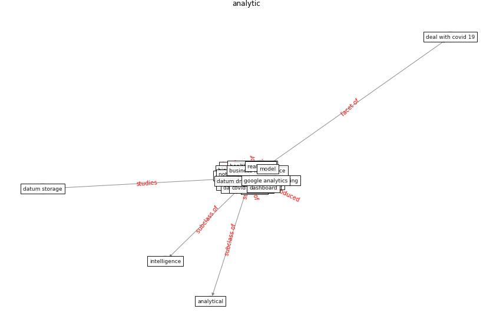

# Keyword: __analytic__
## Clusters

* Cluster 15: [ontology-datum](cluster_15.md)

## Concepts

 

## Articles
* An Overview of Ontologies and Tool Support for
COVID-19 Analytics ([ahmad_overview_2021](article_ahmad_overview_2021.md))
* Pandemic Analytics: How Countries are Leveraging
Big Data Analytics and Artificial Intelligence to
Fight COVID-19? ([mehta_pandemic_2021](article_mehta_pandemic_2021.md))
* Continuous IEQ monitoring system: Context and
development ([parkinson_continuous_2019](article_parkinson_continuous_2019.md))
* Smart cities and a data-driven response to COVID-19 ([james_smart_2020](article_james_smart_2020.md))
* Pandemic Analytics: How Countries are Leveraging
Big Data Analytics and Artificial Intelligence to
Fight COVID-19? ([mehta_pandemic_2021](article_mehta_pandemic_2021.md))
* Internet of things (IoT) applications to fight against
COVID-19 pandemic ([singh_internet_2020](article_singh_internet_2020.md))
* Pandemic Analytics: How Countries are Leveraging
Big Data Analytics and Artificial Intelligence to
Fight COVID-19? ([mehta_pandemic_2021](article_mehta_pandemic_2021.md))
* rtpi_urban_2021-400 ([rtpi_urban_2021-400](article_rtpi_urban_2021-400.md))
* p15-lee-vor ([p15-lee-vor](article_p15-lee-vor.md))
* Designing a Multi-Agent Occupant Simulation
System to Support Facility Planning and Analysis
for COVID-19 ([lee_designing_2021](article_lee_designing_2021.md))
