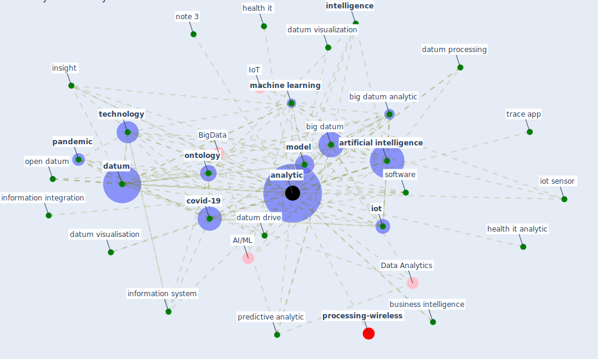

# Keyword: analytic

* [ontology-datum](cluster_12)

## Keywords

 * BigData, Cluster_12, [analytic](keyword_analytic), analytical, analytics, [artificial intelligence](keyword_artificial_intelligence), [big datum](keyword_big_datum), big datum analytic, business intelligence, cloud computing, [covid-19](keyword_covid-19), dashboard, [datum](keyword_datum), datum drive, datum integration, datum mining, datum processing, datum science, datum storage, datum visualisation, datum visualization, dodge data, dodge data and analytics, google analytics, health analytic, health it, health it analytic, information integration, information system, insight, intelligence, [iot](keyword_iot), iot sensor, machine learning, [model](keyword_model), note 3, [ontology](keyword_ontology), open datum, [pandemic](keyword_pandemic), predictive analytic, software, [technology](keyword_technology), trace app

## Mapping

## Neighbours

### Closest articles

* Pandemic Analytics: How Countries are Leveraging Big Data Analytics and Artificial Intelligence to Fight COVID-19? - [LINK](article_mehta_pandemic_2021)
* An Overview of Ontologies and Tool Support for COVID-19 Analytics - [LINK](article_ahmad_overview_2021)
* World Bank Development Report - [LINK](article_world_bank_world_2022)
* Continuous IEQ monitoring system: Context and development - [LINK](article_parkinson_continuous_2019)
* Impact of COVID-19 on IoT Adoption in Healthcare, Smart Homes, Smart Buildings, Smart Cities, Transportation and Industrial IoT - [LINK](article_umair_impact_2021)
* Urban planning after COVID-19 - [LINK](article_rtpi_urban_2021)
* Smart cities and a data-driven response to COVID-19 - [LINK](article_james_smart_2020)
* Internet of things (IoT) applications to fight against COVID-19 pandemic - [LINK](article_singh_internet_2020)
* Guidelines for Responding to COVID-19 Pandemic: Best Practices, Impacts, and Future Research Directions - [LINK](article_assaad_guidelines_2021)
* Response to COVID-19 in Taiwan - [LINK](article_wang_response_2020)

### Closest BPs

