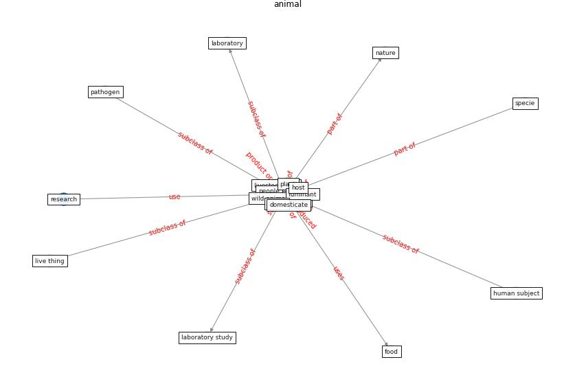

# Keyword: __animal__
## Clusters

* Cluster 9: [climate-change](cluster_9)

## Concepts

 

## Top 10 articles for __animal__
* Attitudes towards outdoor and neighbour noise during the
COVID-19 lockdown: A case study in London ([lee_attitudes_2021](article_lee_attitudes_2021))
* harvard_chan_community_coronavirus_2020 ([harvard_chan_community_coronavirus_2020](article_harvard_chan_community_coronavirus_2020))
* harvard_th_chan_schoold_of_public_health_coronavirus_2020 ([harvard_th_chan_schoold_of_public_health_coronavirus_2020](article_harvard_th_chan_schoold_of_public_health_coronavirus_2020))
* Upper-Room Ultraviolet Light and Negative Air
Ionization to Prevent Tuberculosis Transmission ([escombe_upper-room_2009](article_escombe_upper-room_2009))
* realdania_refleksioner_2022_EN ([realdania_refleksioner_2022_EN](article_realdania_refleksioner_2022_EN))
* The socio-economic determinants of COVID-19: A spatial
analysis of German county level data ([ehlert_socio-economic_2021](article_ehlert_socio-economic_2021))
* COVID19-Routes: A Safe Pedestrian Navigation
Service ([cantarero_covid19-routes_2021](article_cantarero_covid19-routes_2021))
* An Overview of Biomedical Ontologies for Pandemics
and Infectious Diseases Representation ([bayoudhi_overview_2021](article_bayoudhi_overview_2021))
* Environmental factors involved in SARS-CoV-2
transmission: effect and role of indoor environmental
quality in the strategy for COVID-19 infection control ([azuma_environmental_2020](article_azuma_environmental_2020))
* martin_impact_2008 ([martin_impact_2008](article_martin_impact_2008))
