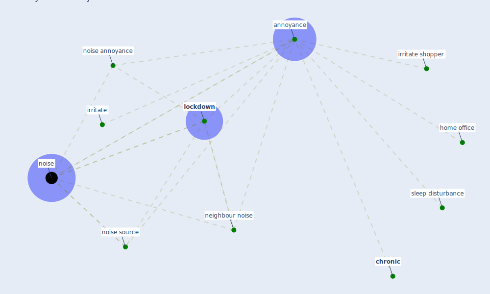

# Keyword: annoyance

## Keywords

 * [annoyance](keyword_annoyance), [chronic](keyword_chronic), home office, irritate, irritate shopper, [lockdown](keyword_lockdown), [neighbour noise](keyword_neighbour_noise), [noise](keyword_noise), noise annoyance, [noise source](keyword_noise_source), sleep disturbance

## Mapping

## Neighbours

### Closest articles

* Attitudes towards outdoor and neighbour noise during the COVID-19 lockdown: A case study in London - [LINK](article_lee_attitudes_2021)
* How COVID-19 Could Accelerate the Adoption of New Retail Technologies and Enhance the (E-)Servicescape - [LINK](article_willems_how_2021)
* A critical analysis of the impacts of COVID-19 on the global economy and ecosystems and opportunities for circular economy strategies - [LINK](article_ibn-mohammed_critical_2021)

### Closest BPs

