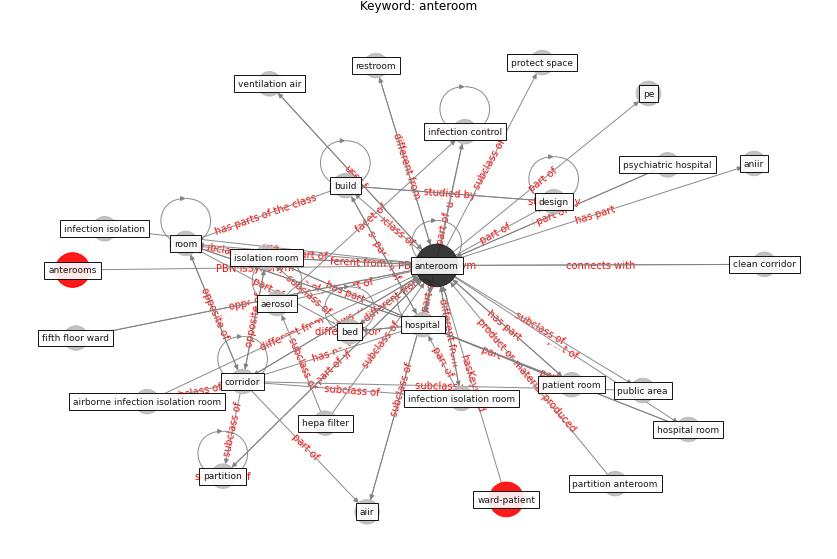

# Keyword: anteroom

* [ward-patient](cluster_Cluster_15)

## Keywords

 * Cluster_15, [aerosol](keyword_aerosol), [aiir](keyword_aiir), airborne infection isolation room, aniir, [anteroom](keyword_anteroom), anterooms, [bed](keyword_bed), [build](keyword_build), clean corridor, [corridor](keyword_corridor), [design](keyword_design), fifth floor ward, hepa filter, [hospital](keyword_hospital), hospital room, [infection control](keyword_infection_control), infection isolation, infection isolation room, isolation room, partition, partition anteroom, patient room, pe, protect space, psychiatric hospital, public area, restroom, [room](keyword_room), ventilation air, [ward](keyword_ward)

## Concepts

 

## Neighbours

### Closest articles

* Rapid expansion of temporary, reliable airborne-infection isolation rooms with negative air machines for critical COVID-19 patients - [LINK](article_lee_rapid_2020)
* ASHRAE Position Document on Infectious Aerosols - [LINK](article_ashrae_ashrae_2022)
* A Review on Building Design as a Biomedical System for Preventing COVID-19 Pandemic - [LINK](article_amran_review_2022)
* Toilets dominate environmental detection of SARS-CoV-2 virus in a hospital - [LINK](article_ding_toilets_2020)
* COVID-19 Forced Hospitals to Build Negative Pressure Rooms Fast - [LINK](article_dyer_covid-19_2020)
* Air, Surface Environmental, and Personal Protective Equipment Contamination by Severe Acute Respiratory Syndrome Coronavirus 2 (SARS-CoV-2) From a Symptomatic Patient - [LINK](article_ong_air_2020)
* A critical review of heating, ventilation, and air conditioning (HVAC) systems within the context of a global SARS-CoV-2 epidemic - [LINK](article_elsaid_critical_2021)
* Review and comparison of HVAC operation guidelines in different countries during the COVID-19 pandemic - [LINK](article_guo_review_2021)
* 2019 Novel Coronavirus (COVID-19) Pandemic: Built Environment Considerations To Reduce Transmission - [LINK](article_dietz_2019_2020)

### Closest BPs

