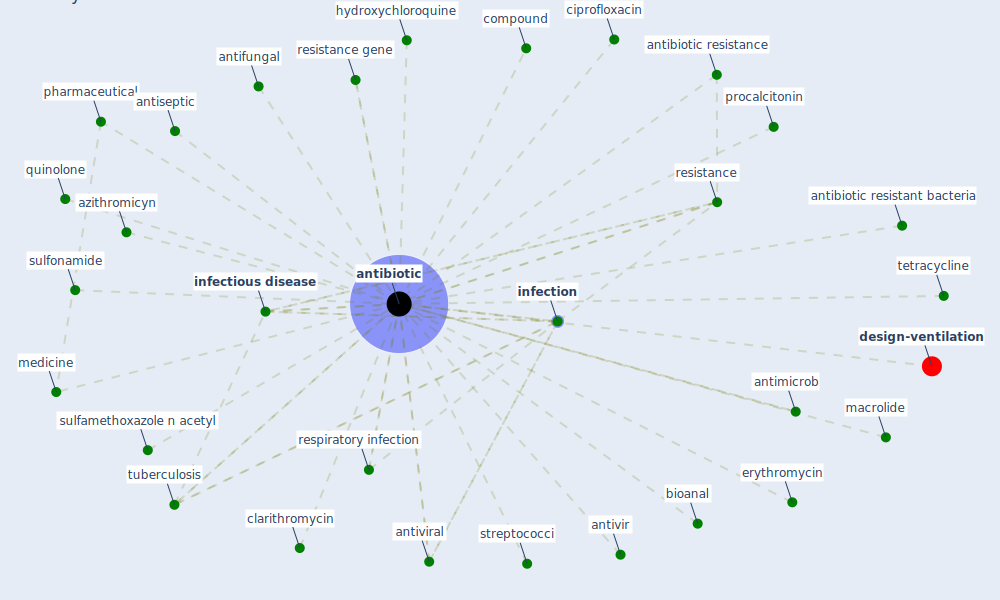

# Keyword: antibiotic

* [design-ventilation](cluster_12)

## Keywords

 * Cluster_12, [antibiotic](keyword_antibiotic), antibiotic resistance, antibiotic resistance gene, antibiotic resistant bacteria, antibiotics, antibioticークresistance1, antifungal, antimicrob, [antimicrobial](keyword_antimicrobial), antiseptic, antivir, [antiviral](keyword_antiviral), azithromicyn, bioanal, chemrxiv, ciprofloxacin, clarithromycin, colistin, communicable infection, compound, [covid-19](keyword_covid-19), [disease](keyword_disease), [disinfectant](keyword_disinfectant), erythromycin, hemolytic streptococci, history of the past pandemic, hydroxychloroquine, [infection](keyword_infection), [infectious disease](keyword_infectious_disease), macrolide, macrolide antibiotic, medicine, medrx, methicillin, multidrug resistant, past pandemic, pharmaceutical, povidone, procalcitonin, quinolone, resistance, resistance gene, respiratory infection, streptococci, sublethal, sulfamethoxazole n acetyl, sulfonamide, tetracycline, [tuberculosis](keyword_tuberculosis)

## Mapping

## Neighbours

### Closest articles

* Future perspectives of wastewater-based epidemiology: Monitoring infectious disease spread and resistance to the community level - [LINK](article_sims_future_2020)
* An environmental and health perspective for COVID-19 outbreak: Meteorology and air quality influence, sewage epidemiology indicator, hospitals disinfection, drug therapies and recommendations - [LINK](article_barcelo_environmental_2020)
* The Role of Architecture and Urbanism in Preventing Pandemics - [LINK](article_kumar_role_2021)
* Nurture to nature via COVID-19, a self-regenerating environmental strategy of environment in global context - [LINK](article_paital_nurture_2020)
* A Review on Building Design as a Biomedical System for Preventing COVID-19 Pandemic - [LINK](article_amran_review_2022)
* Upper-Room Ultraviolet Light and Negative Air Ionization to Prevent Tuberculosis Transmission - [LINK](article_escombe_upper-room_2009)
*  - [LINK](article_yakubu_aminu_dodo_green_2020)
* COVID-19 Could Leverage a Sustainable Built Environment - [LINK](article_pinheiro_covid-19_2020)
* Architectural design strategies for infection prevention and control (IPC) in health-care facilities: towards curbing the spread of Covid-19 \textbar SpringerLink - [LINK](article_udomiaye_architectural_2020)
* Analysis of COVID-19 Concerns Raised by the Construction Workforce and Development of Mitigation Practices - [LINK](article_bou_hatoum_analysis_2021)

### Closest BPs

