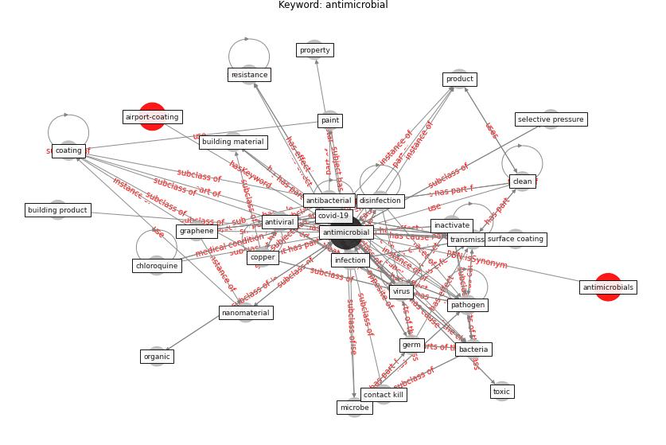

# Keyword: __antimicrobial__
## Clusters

* Cluster 11: [surface-coating](cluster_11)

## Concepts

 

## Articles
* Graphene-based nanomaterials as antimicrobial surface
coatings: A parallel approach to restrain the expansion
of COVID-19 ([ayub_graphene-based_2021](article_ayub_graphene-based_2021))
* Designing Post COVID-19 Buildings: Approaches for
Achieving Healthy Buildings ([navaratnam_designing_2022](article_navaratnam_designing_2022))
* Prophylactic Architecture: Formulating the Concept
of Pandemic-Resilient Homes ([elrayies_prophylactic_2022](article_elrayies_prophylactic_2022))
* A Continuously Active Antimicrobial Coating
effective against Human Coronavirus 229E ([ikner_continuously_2020](article_ikner_continuously_2020))
* Future perspectives of wastewater-based epidemiology:
Monitoring infectious disease spread and resistance to
the community level ([sims_future_2020](article_sims_future_2020))
* kansai_airport_kix_2021 ([kansai_airport_kix_2021](article_kansai_airport_kix_2021))
* A Global Survey of Infection Control and
Mitigation Measures for Combating the Transmission
of COVID-19 Pandemic in Buildings Under
Facilities Management Services ([sarvari_global_2022](article_sarvari_global_2022))
* A Global Survey of Infection Control and
Mitigation Measures for Combating the Transmission
of COVID-19 Pandemic in Buildings Under
Facilities Management Services ([sarvari_global_2022](article_sarvari_global_2022))
* Readiness Assessment of Green Building
Certification Systems for Residential Buildings
during Pandemics ([tleuken_readiness_2021](article_tleuken_readiness_2021))
* Indoor Air Quality: Rethinking rules of building
design strategies in post-pandemic architecture ([megahed_indoor_2021](article_megahed_indoor_2021))
