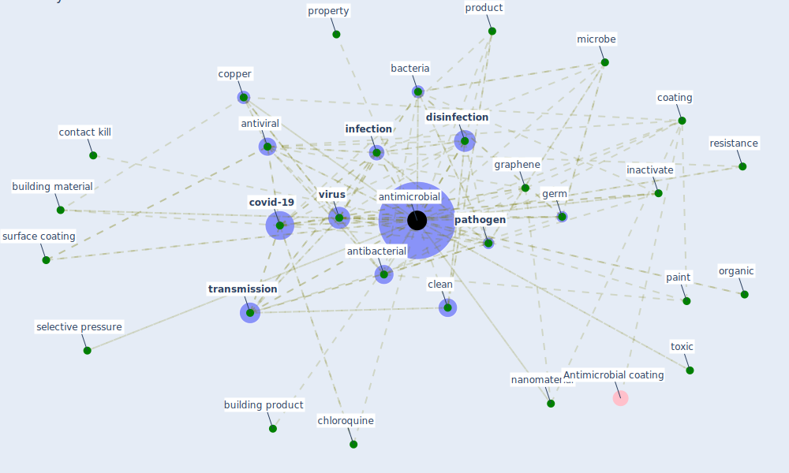

# Keyword: antimicrobial

## Keywords

 * acta biomater, additive, [agent](keyword_agent), anti biofoule, antibacterial, [antibiotic](keyword_antibiotic), antibiotic resistance, [antimicrobial](keyword_antimicrobial), antimicrobials, [antiviral](keyword_antiviral), as sociation, [bacteria](keyword_bacteria), building material, building product, carbon base, cardboard, chemical, chloroquine, [clean](keyword_clean), clean equipment, [coating](keyword_coating), compound, contact kill, [copper](keyword_copper), copper alloy, copper touch surface, copperbase, cotton, cotton fabric, [covid-19](keyword_covid-19), covidkille, crossref frost, de rivative, [disinfectant](keyword_disinfectant), [disinfection](keyword_disinfection), evi dence, fullerene, gbns, germ, go, go sheet, gra phene, [graphene](keyword_graphene), graphene oxide, hydroxychloroquine, inactivate, [infection](keyword_infection), infectious particle, inorganic, isolation, kill, kriontm, [material](keyword_material), mechanism, mechanism of action, mechanism of action of gbns against virus, microbe, nano coating, nanomaterial, nanoparticle, nanosheet, nanotechnology, organic, paint, [pathogen](keyword_pathogen), phytoncide, plastic, polyallylamine, [polymer](keyword_polymer), prescribe, product, proper tie, property, protection, resistance, richlite, richlite 15 of 31, [sar cov 2](keyword_sar_cov_2), selective pressure, silver nanoparticle, sterilizer, strek, [surface](keyword_surface), surface coating, surface functionalization, surfacewise2, toxic, [transmission](keyword_transmission), ultraviolet uv light exposure, [virus](keyword_virus)

## Mapping

## Neighbours

### Closest articles

* Graphene-based nanomaterials as antimicrobial surface coatings: A parallel approach to restrain the expansion of COVID-19 - [LINK](article_ayub_graphene-based_2021)
* Designing Post COVID-19 Buildings: Approaches for Achieving Healthy Buildings - [LINK](article_navaratnam_designing_2022)
* Prophylactic Architecture: Formulating the Concept of Pandemic-Resilient Homes - [LINK](article_elrayies_prophylactic_2022)
* How is COVID-19 Experience Transforming Sustainability Requirements of Residential Buildings? A Review - [LINK](article_tokazhanov_how_2020)
* A Continuously Active Antimicrobial Coating effective against Human Coronavirus 229E - [LINK](article_ikner_continuously_2020)
* Future perspectives of wastewater-based epidemiology: Monitoring infectious disease spread and resistance to the community level - [LINK](article_sims_future_2020)
* Environmental factors involved in SARS-CoV-2 transmission: effect and role of indoor environmental quality in the strategy for COVID-19 infection control - [LINK](article_azuma_environmental_2020)
* Readiness Assessment of Green Building Certification Systems for Residential Buildings during Pandemics - [LINK](article_tleuken_readiness_2021)
* A Global Survey of Infection Control and Mitigation Measures for Combating the Transmission of COVID-19 Pandemic in Buildings Under Facilities Management Services - [LINK](article_sarvari_global_2022)
* An environmental and health perspective for COVID-19 outbreak: Meteorology and air quality influence, sewage epidemiology indicator, hospitals disinfection, drug therapies and recommendations - [LINK](article_barcelo_environmental_2020)

### Closest BPs

