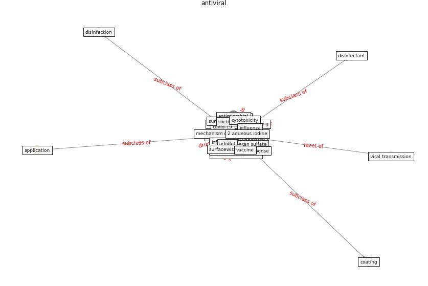

# Keyword: __antiviral__
## Clusters

* Cluster 11: [surface-coating](cluster_11.md)

## Concepts

 

## Articles
* Graphene-based nanomaterials as antimicrobial surface
coatings: A parallel approach to restrain the expansion
of COVID-19 ([ayub_graphene-based_2021](article_ayub_graphene-based_2021.md))
* Physical interventions to interrupt or reduce the spread
of respiratory viruses: systematic review ([jefferson_physical_2008](article_jefferson_physical_2008.md))
* Future perspectives of wastewater-based epidemiology:
Monitoring infectious disease spread and resistance to
the community level ([sims_future_2020](article_sims_future_2020.md))
* Future perspectives of wastewater-based epidemiology:
Monitoring infectious disease spread and resistance to
the community level ([sims_future_2020](article_sims_future_2020.md))
* Designing Post COVID-19 Buildings: Approaches for
Achieving Healthy Buildings ([navaratnam_designing_2022](article_navaratnam_designing_2022.md))
* A Surface Coating that Rapidly Inactivates
SARS-CoV-2 ([behzadinasab_surface_2020](article_behzadinasab_surface_2020.md))
* Infodemic and the spread of fake news in the
COVID-19-era ([orso_infodemic_2020](article_orso_infodemic_2020.md))
* From Viral City to Smart City: Learning from
Pandemic Experiences ([sakellarides_viral_2020](article_sakellarides_viral_2020.md))
* A Comprehensive Review of the COVID-19 Pandemic
and the Role of IoT, Drones, AI, Blockchain, and
5G in Managing its Impact ([chamola_comprehensive_2020](article_chamola_comprehensive_2020.md))
* Sustainability of Coronavirus on Different
Surfaces ([suman_sustainability_2020](article_suman_sustainability_2020.md))
