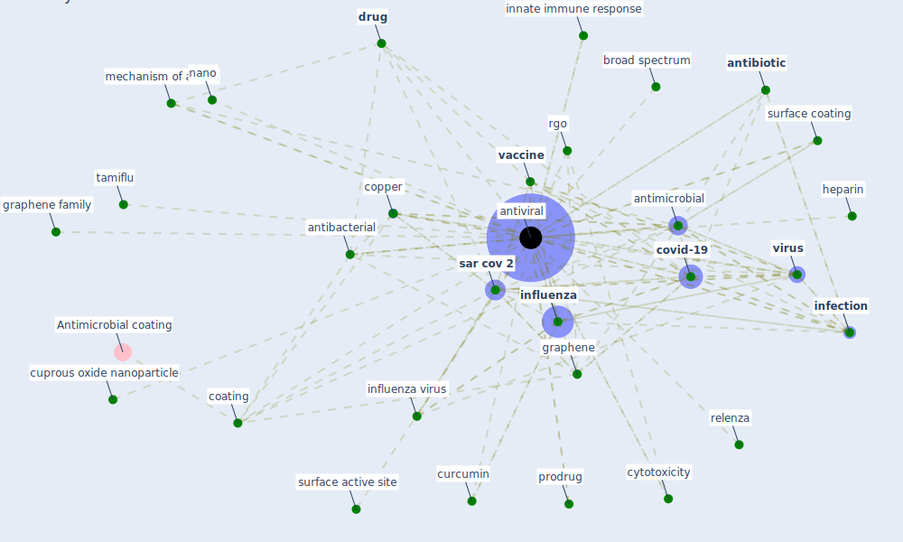

# Keyword: antiviral

## Keywords

 * 2 aqueous iodine, antibacterial, [antibiotic](keyword_antibiotic), [antimicrobial](keyword_antimicrobial), [antiviral](keyword_antiviral), antivirals, [application](keyword_application), arbidol, broad spectrum, carbon nanomaterial, [coating](keyword_coating), cochemical, [copper](keyword_copper), [coronavirus](keyword_coronavirus), [covid-19](keyword_covid-19), cuprous oxide nanoparticle, curcumin, cytotoxicity, [disinfectant](keyword_disinfectant), [disinfection](keyword_disinfection), [drug](keyword_drug), fullerene, fullerene tris aminocaproic acid hydrate, go, [graphene](keyword_graphene), graphene family, gs 5734, gs 5734 inhibit, heparan sulfate, heparin, inactivation, [infection](keyword_infection), [influenza](keyword_influenza), [influenza virus](keyword_influenza_virus), innate immune response, mechanism of action, nano, oseltamivir, prodrug, relenza, remdesivir, rgo, [sar cov 2](keyword_sar_cov_2), struc ture, surface active site, surface charge, surface coating, surface protective coating, surfacewise 2, tamiflu, [vaccine](keyword_vaccine), vinylpyrrolidone, [virus](keyword_virus), virus capture mechanism

## Mapping

## Neighbours

### Closest articles

* Graphene-based nanomaterials as antimicrobial surface coatings: A parallel approach to restrain the expansion of COVID-19 - [LINK](article_ayub_graphene-based_2021)
* Physical interventions to interrupt or reduce the spread of respiratory viruses: systematic review - [LINK](article_jefferson_physical_2008)
* Future perspectives of wastewater-based epidemiology: Monitoring infectious disease spread and resistance to the community level - [LINK](article_sims_future_2020)
* COVID-19 Pandemic: Prevention and Protection Measures to Be Adopted at the Workplace - [LINK](article_cirrincione_covid-19_2020)
* The Role of Architecture and Urbanism in Preventing Pandemics - [LINK](article_kumar_role_2021)
* Designing Post COVID-19 Buildings: Approaches for Achieving Healthy Buildings - [LINK](article_navaratnam_designing_2022)
* Sars-CoV-2 (COVID-19) inactivation capability of copper-coated touch surface fabricated by cold-spray technology - [LINK](article_hutasoit_sars-cov-2_2020)
* A Surface Coating that Rapidly Inactivates SARS-CoV-2 - [LINK](article_behzadinasab_surface_2020)
* Infodemic and the spread of fake news in the COVID-19-era - [LINK](article_orso_infodemic_2020)
* A Comprehensive Review of the COVID-19 Pandemic and the Role of IoT, Drones, AI, Blockchain, and 5G in Managing its Impact - [LINK](article_chamola_comprehensive_2020)

### Closest BPs

