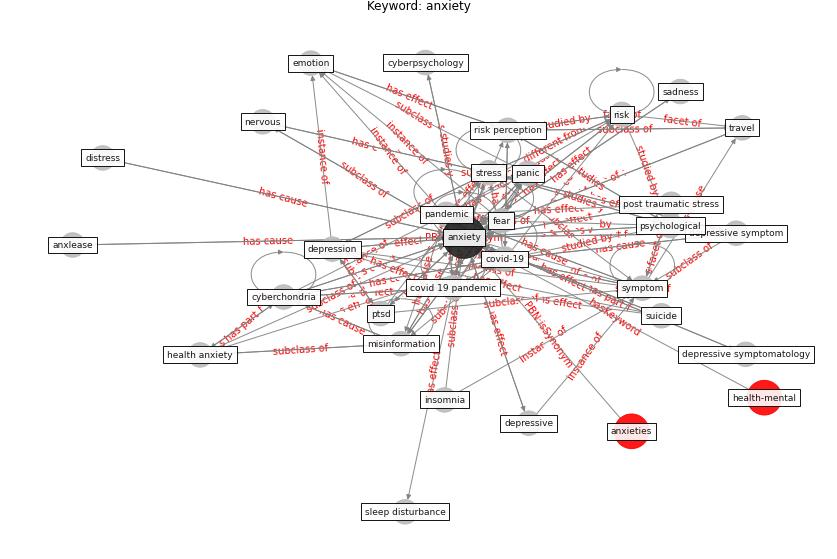

# Keyword: anxiety

* [mental-health](cluster_Cluster_11)

## Keywords

 * I do not feel frightened, affective reaction, [anxiety](keyword_anxiety), anxiety disorder, anxiety sensitivity, [concentration](keyword_concentration), condition, [corona](keyword_corona), corona phobia, coronavirus anxiety scale, correlation, covid 19 anxiety, [covid 19 crisis](keyword_covid_19_crisis), covid 19 outbreak, [covid 19 pandemic](keyword_covid_19_pandemic), covid 19 risk perception, [covid-19](keyword_covid-19), [cyberchondria](keyword_cyberchondria), cyberpsychology, [depression](keyword_depression), depressive, [depressive symptom](keyword_depressive_symptom), depressive symptomatology, disord, distress, emotion, emotional problem, emotional state, factor, [fear](keyword_fear), functional impairment, generalize anxiety, health anxiety, high level, live alone, [loneliness](keyword_loneliness), [measure](keyword_measure), mental and behavioural disorder, mental disorder, [mental health](keyword_mental_health), mental health concern, mental health condition, mental health disorder, mental health issue, mental illness, mental problem, mental wellbeing, [misinformation](keyword_misinformation), moderate, mood, moodiness, [mortality](keyword_mortality), negative economic impact, nervous, observational cohort study, [pandemic](keyword_pandemic), panic, panic buying, panic disorder, [participant](keyword_participant), [perceive risk](keyword_perceive_risk), perception of safety, [physical health](keyword_physical_health), [post traumatic stress](keyword_post_traumatic_stress), post traumatic stress disorder, post traumatic stress symptom, [pressure](keyword_pressure), psychiatric symptom, [psychological](keyword_psychological), psychological disorder, psychological distress, [psychological health](keyword_psychological_health), psychological problem, psychological well be, [ptsd](keyword_ptsd), rational decision, relax, [risk](keyword_risk), risk factor, [risk perception](keyword_risk_perception), rural area, sadness, self reflection, severe, sleep disturbance, [social medium](keyword_social_medium), [stress](keyword_stress), stress level, stressful, suicide, survivalist, [symptom](keyword_symptom), symptom search, threaten, [travel](keyword_travel), travel anxiety, uncertainty, [urban area](keyword_urban_area), [wellbee](keyword_wellbee), worry

## Concepts

 

## Neighbours

### Closest articles

* Psychological Effects of Home Confinement and Social Distancing Derived from COVID-19 in the General Population—A Systematic Review - [LINK](article_rodriguez-fernandez_psychological_2021)
* Should I Stay or Should I Go? Tourists’ COVID-19 Risk Perception and Vacation Behavior Shift - [LINK](article_bratic_should_2021)
* The changes in the effects of social media use of Cypriots due to COVID-19 pandemic - [LINK](article_kaya_changes_2020)
* Association between indoor-outdoor green features and psychological health during the COVID-19 lockdown in Italy: A cross-sectional nationwide study - [LINK](article_spano_association_2021)
* Impacts of COVID-19 on Health and Safety of Workforce in Construction Industry - [LINK](article_pamidimukkala_impacts_2021)
* Occupant health in buildings: Impact of the COVID-19 pandemic on the opinions of building professionals and implications on research - [LINK](article_awada_occupant_2022)
* What drives unverified information sharing and cyberchondria during the COVID-19 pandemic? - [LINK](article_laato_what_2020)
* Management of the COVID-19 pandemic: challenges, practices, and organizational support - [LINK](article_hossny_management_2022)
* How COVID-19 Could Accelerate the Adoption of New Retail Technologies and Enhance the (E-)Servicescape - [LINK](article_willems_how_2021)
* Home garden use during COVID-19: Associations with physical and mental wellbeing in older adults - [LINK](article_corley_home_2021)

### Closest BPs

