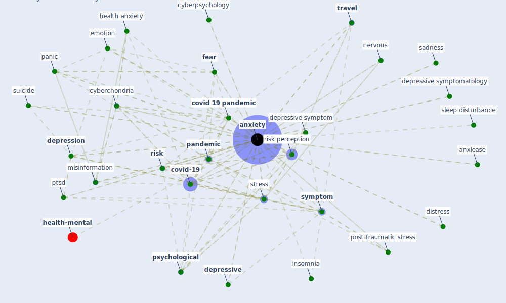

# Keyword: anxiety

## Keywords

 * I do not feel frightened, affective reaction, age, anguish, [anxiety](keyword_anxiety), anxiety about health, anxiety disorder, anxiety sensitivity, anxiety subj anger, anxlease, aspecific and uncontrolled fears related to infections, bai, bai depression, [concentration](keyword_concentration), condition, corona phobia, coronavirus anxiety scale, correlation, covid 19 anxiety, [covid 19 crisis](keyword_covid_19_crisis), covid 19 outbreak, [covid 19 pandemic](keyword_covid_19_pandemic), covid 19 risk perception, [covid-19](keyword_covid-19), cut off point, [cyberchondria](keyword_cyberchondria), cyberpsychology, [depression](keyword_depression), depressive, [depressive symptom](keyword_depressive_symptom), depressive symptomatology, disord, distress, emotion, [factor](keyword_factor), fear, generalize anxiety, generalize anxiety disorder, [health](keyword_health), health anxiety, health relate symptom, high level, hyperarousal, insomnia, [level](keyword_level), live alone, [loneliness](keyword_loneliness), [measure](keyword_measure), [misinformation](keyword_misinformation), moderate, mood, moodiness, [mortality](keyword_mortality), negative economic impact, nervous, nervousness, [pandemic](keyword_pandemic), [panic](keyword_panic), panic buying, panic disorder, [participant](keyword_participant), [perceive risk](keyword_perceive_risk), perception of safety, [post traumatic stress](keyword_post_traumatic_stress), post traumatic stress disorder, post traumatic stress symptom, [pressure](keyword_pressure), psychiatric symptom, [psychological](keyword_psychological), ptsd, relax, [risk](keyword_risk), risk anxiety, risk factor, [risk perception](keyword_risk_perception), sadness, sd g, self reflection, severe, sleep disturbance, [stress](keyword_stress), stress level, stressful, stressful situation, suicide, survivalist, sydeman, [symptom](keyword_symptom), symptom search, threaten, [travel](keyword_travel), travel anxiety, two dimension, uncertainty, uncertainty about the future, urban area, [well be](keyword_well_be), [wellbee](keyword_wellbee), whitely index, worry

## Mapping

## Neighbours

### Closest articles

* Psychological Effects of Home Confinement and Social Distancing Derived from COVID-19 in the General Population—A Systematic Review - [LINK](article_rodriguez-fernandez_psychological_2021)
* Should I Stay or Should I Go? Tourists’ COVID-19 Risk Perception and Vacation Behavior Shift - [LINK](article_bratic_should_2021)
* The changes in the effects of social media use of Cypriots due to COVID-19 pandemic - [LINK](article_kaya_changes_2020)
* Association between indoor-outdoor green features and psychological health during the COVID-19 lockdown in Italy: A cross-sectional nationwide study - [LINK](article_spano_association_2021)
* The psychological impact of COVID-19 on the mental health in the general population - [LINK](article_serafini_psychological_2020)
* Occupant health in buildings: Impact of the COVID-19 pandemic on the opinions of building professionals and implications on research - [LINK](article_awada_occupant_2022)
* Impacts of COVID-19 on Health and Safety of Workforce in Construction Industry - [LINK](article_pamidimukkala_impacts_2021)
* Management of the COVID-19 pandemic: challenges, practices, and organizational support - [LINK](article_hossny_management_2022)
* What drives unverified information sharing and cyberchondria during the COVID-19 pandemic? - [LINK](article_laato_what_2020)
* How COVID-19 Could Accelerate the Adoption of New Retail Technologies and Enhance the (E-)Servicescape - [LINK](article_willems_how_2021)

### Closest BPs

