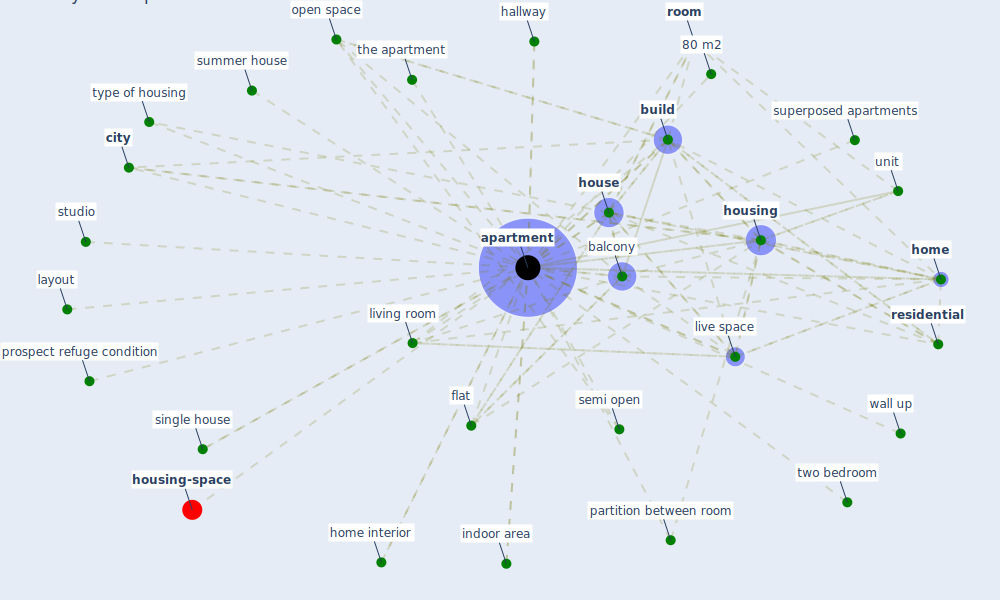

# Keyword: apartment

* [space-housing](cluster_4)

## Keywords

 * 80 m2, Cluster_4, airflow, [apartment](keyword_apartment), apartments, [balcony](keyword_balcony), bathroom, bedroom design, [build](keyword_build), building level, [city](keyword_city), construction phase, farm, flat, four room, four room apartment, hallway, [home](keyword_home), home interior, [house](keyword_house), [housing](keyword_housing), housing issue, housing more than 4 people, housing typology, indoor area, layout, live space, living room, mid rise, multifamily, open space, partition between room, prospect refuge condition, [residential](keyword_residential), [room](keyword_room), semi open, single house, studio, summer house, superposed apartments, the apartment, two bedroom, type of housing, unit, wall up, [window](keyword_window)

## Mapping

## Neighbours

### Closest articles

* Towards Resilient Residential Buildings and Neighborhoods in Light of COVID-19 Pandemic—The Scenario of Podgorica, Montenegro - [LINK](article_bojovic_towards_2022)
* Questioning the use of the balcony in apartments during the COVID-19 pandemic process - [LINK](article_aydin_questioning_2020)
* How our homes impact our health: using a COVID-19 informed approach to examine urban apartment housing - [LINK](article_peters_how_2020)
* Adaptive Design of the Built Environment to Mitigate the Transmission Risk of COVID-19 - [LINK](article_ara_dilshad_shangi_adaptive_2020)
* The role of green roofs in post COVID-19 confinement: An analysis of willingness to pay - [LINK](article_manso_role_2021)
* Prophylactic Architecture: Formulating the Concept of Pandemic-Resilient Homes - [LINK](article_elrayies_prophylactic_2022)
* Assessment method for new sustainability indicators providing pandemic resilience for residential buildings - [LINK](article_tokazhanov_assessment_2021)
* Readiness Assessment of Green Building Certification Systems for Residential Buildings during Pandemics - [LINK](article_tleuken_readiness_2021)
* Designing for COVID-2x: Reflecting on Future-Proofing Human Habitation for the Inevitable Next Pandemic - [LINK](article_spennemann_designing_2022)
* COVID-19 Lockdown: Housing Built Environment’s Effects on Mental Health - [LINK](article_amerio_covid-19_2020)

### Closest BPs

