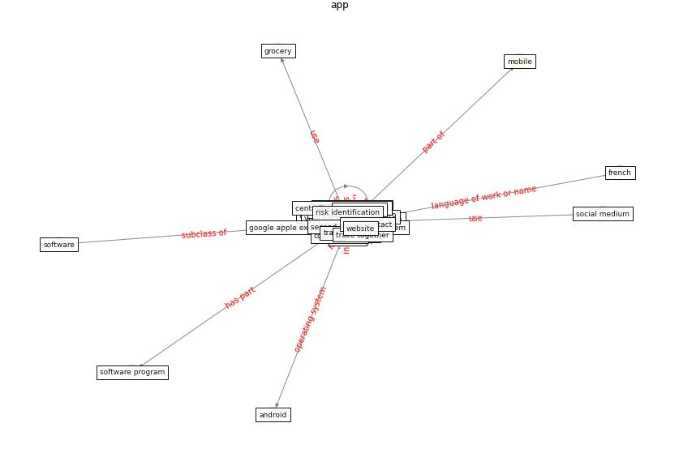

# Keyword: __app__
## Clusters

* Cluster 13: [blockchain-technology](cluster_13.md)

## Concepts

 

## Articles
* council_of_europe_2020_2020-400 ([council_of_europe_2020_2020-400](article_council_of_europe_2020_2020-400.md))
* council_of_europe_2020_2020-450 ([council_of_europe_2020_2020-450](article_council_of_europe_2020_2020-450.md))
* A Comprehensive Review of the COVID-19 Pandemic
and the Role of IoT, Drones, AI, Blockchain, and
5G in Managing its Impact ([chamola_comprehensive_2020](article_chamola_comprehensive_2020.md))
* council_of_europe_2020_2020-250 ([council_of_europe_2020_2020-250](article_council_of_europe_2020_2020-250.md))
* Mobile Technology Solution for COVID-19:
Surveillance and Prevention ([raza_mobile_2021](article_raza_mobile_2021.md))
* Retail Signage During the COVID-19 Pandemic ([mcneish_retail_2020](article_mcneish_retail_2020.md))
* A Comprehensive Review of the COVID-19 Pandemic
and the Role of IoT, Drones, AI, Blockchain, and
5G in Managing its Impact ([chamola_comprehensive_2020](article_chamola_comprehensive_2020.md))
* Pandemic Analytics: How Countries are Leveraging
Big Data Analytics and Artificial Intelligence to
Fight COVID-19? ([mehta_pandemic_2021](article_mehta_pandemic_2021.md))
* council_of_europe_2020_2020-150 ([council_of_europe_2020_2020-150](article_council_of_europe_2020_2020-150.md))
* council_of_europe_2020_2020-600 ([council_of_europe_2020_2020-600](article_council_of_europe_2020_2020-600.md))
