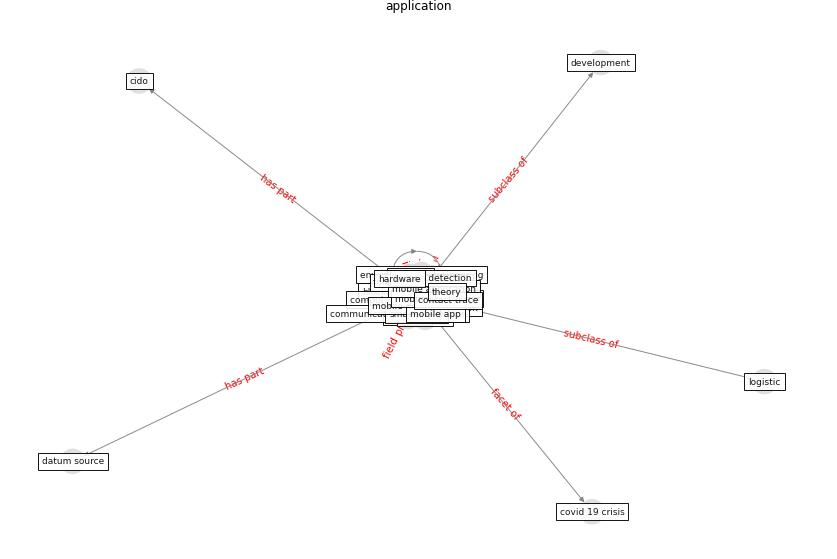

# Keyword: __application__
## Clusters

* Cluster 13: [blockchain-technology](cluster_13.md)

## Concepts

 

## Articles
* Mobile Technology Solution for COVID-19:
Surveillance and Prevention ([raza_mobile_2021](article_raza_mobile_2021.md))
* A Comprehensive Review of the COVID-19 Pandemic
and the Role of IoT, Drones, AI, Blockchain, and
5G in Managing its Impact ([chamola_comprehensive_2020](article_chamola_comprehensive_2020.md))
* Digital Twin of COVID-19 Mass Vaccination
Centers ([pilati_digital_2021](article_pilati_digital_2021.md))
* Leveraging Digital Transformation Technologies to
Tackle COVID-19: Proposing a Privacy-First
Holistic Framework ([arpaci_leveraging_2021](article_arpaci_leveraging_2021.md))
* The role of 5G for digital healthcare against COVID-19
pandemic: Opportunities and challenges ([siriwardhana_role_2021](article_siriwardhana_role_2021.md))
* An Intelligent IEQ Monitoring and Feedback
System: Development and Applications ([geng_intelligent_2021](article_geng_intelligent_2021.md))
* Learning from pandemics: Applying resilience thinking to
identify priorities for planning urban settlements ([syal_learning_2021](article_syal_learning_2021.md))
* COVID19-Routes: A Safe Pedestrian Navigation
Service ([cantarero_covid19-routes_2021](article_cantarero_covid19-routes_2021.md))
* Internet of things (IoT) applications to fight against
COVID-19 pandemic ([singh_internet_2020](article_singh_internet_2020.md))
* Scalable IoT Architecture for Monitoring IEQ
Conditions in Public and Private Buildings ([calvo_scalable_2022](article_calvo_scalable_2022.md))
