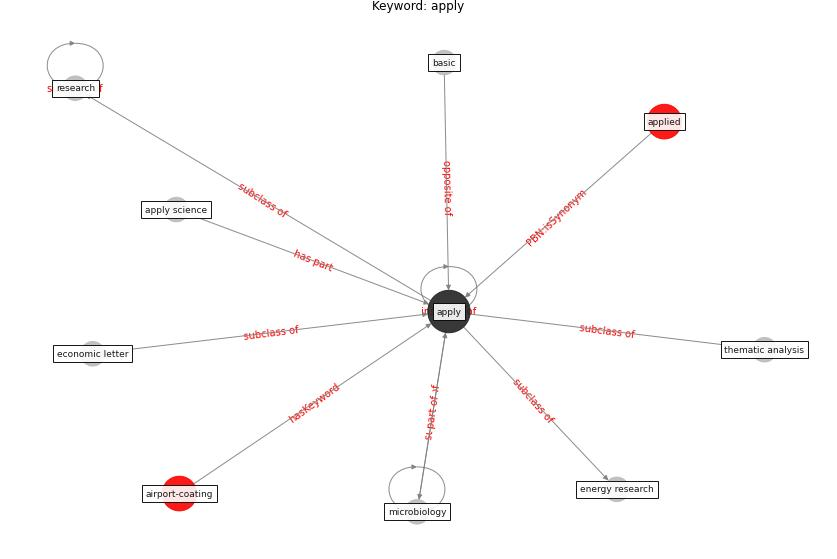

# Keyword: apply

* [airport-coating](cluster_Cluster_6)

## Keywords

 * Cluster_6, applied, [apply](keyword_apply), apply science, basic, economic letter, energy research, microbiology, [research](keyword_research), thematic analysis

## Concepts

 

## Neighbours

### Closest articles

* Upper-room ultraviolet air disinfection might help to reduce COVID-19 transmission in buildings: a feasibility study - [LINK](article_beggs_upper-room_2020)
* Methods for air cleaning and protection of building occupants from airborne pathogens - [LINK](article_bolashikov_methods_2009)
* Effect of Ultraviolet Germicidal Irradiation on Viral Aerosols - [LINK](article_walker_effect_2007)
* ASHRAE Position Document on Infectious Aerosols - [LINK](article_ashrae_ashrae_2022)
* Validity of energy social research during and after COVID-19: challenges, considerations, and responses - [LINK](article_fell_validity_2020)
* Urban planning after COVID-19 - [LINK](article_rtpi_urban_2021)
* Respiratory pandemics, urban planning and design: A multidisciplinary rapid review of the literature - [LINK](article_harris_respiratory_2022)
* Designing a Multi-Agent Occupant Simulation System to Support Facility Planning and Analysis for COVID-19 - [LINK](article_lee_designing_2021)
* Digital technology and COVID-19 - [LINK](article_ting_digital_2020)

### Closest BPs

