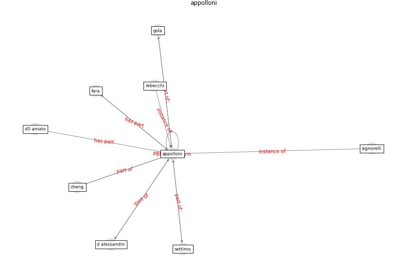

# Keyword: __appolloni__
## Clusters

* Cluster 8: [health-housing](cluster_8)

## Concepts

 

## Top 10 articles for __appolloni__
* A Mixed Approach on Resilience of Spanish
Dwellings and Households during COVID-19 Lockdown ([cuerdo-vilches_mixed_2020](article_cuerdo-vilches_mixed_2020))
* How is COVID-19 Experience Transforming
Sustainability Requirements of Residential
Buildings? A Review ([tokazhanov_how_2020](article_tokazhanov_how_2020))
* COVID-19 and the UN Sustainable Development
Goals: Threat to Solidarity or an Opportunity? ([leal_filho_covid-19_2020](article_leal_filho_covid-19_2020))
* Readiness Assessment of Green Building
Certification Systems for Residential Buildings
during Pandemics ([tleuken_readiness_2021](article_tleuken_readiness_2021))
* Exploring the Non-Medical impacts of Covid-19 using
Natural Language Processing ([agade_exploring_2020](article_agade_exploring_2020))
* Respiratory pandemics, urban planning and design: A
multidisciplinary rapid review of the literature ([harris_respiratory_2022](article_harris_respiratory_2022))
* COVID-19 and Green Housing: A Review of
Relevant Literature ([kaklauskas_covid-19_2021](article_kaklauskas_covid-19_2021))
* RESIDENTIAL ARCHITECTURE IN A POST-PANDEMIC
WORLD: IMPLICATIONS OF COVID-19 FOR NEW
CONSTRUCTION AND FOR ADAPTING HERITAGE
BUILDINGS ([spennemann_residential_2021](article_spennemann_residential_2021))
