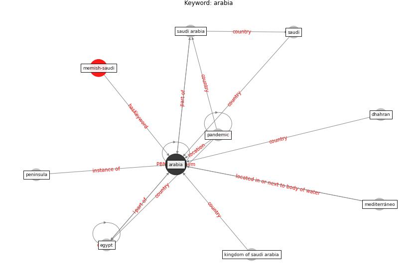

# Keyword: arabia

* [memish-saudi](cluster_Cluster_8)

## Keywords

 * Cluster_8, [arabia](keyword_arabia), dhahran, egypt, kingdom of saudi arabia, mediterráneo, [pandemic](keyword_pandemic), peninsula, [saudi](keyword_saudi), [saudi arabia](keyword_saudi_arabia)

## Concepts

 

## Neighbours

### Closest articles

* Assessment of COVID-19 precautionary measures in sports facilities: A case study on a health club in Saudi Arabia - [LINK](article_ibrahim_assessment_2022)
* The impact of climate change on the epidemiology and control of Rift Valley fever - PubMed - [LINK](article_martin_impact_2008)
* Housing Experience in Gated Communities in the Time of Pandemics: Lessons Learned from COVID-19 - [LINK](article_asfour_housing_2022)
* A Comprehensive Review of the COVID-19 Pandemic and the Role of IoT, Drones, AI, Blockchain, and 5G in Managing its Impact - [LINK](article_chamola_comprehensive_2020)
* World Bank Development Report - [LINK](article_world_bank_world_2022)
* 2019 Novel Coronavirus (COVID-19) Pandemic: Built Environment Considerations To Reduce Transmission - [LINK](article_dietz_2019_2020)

### Closest BPs

