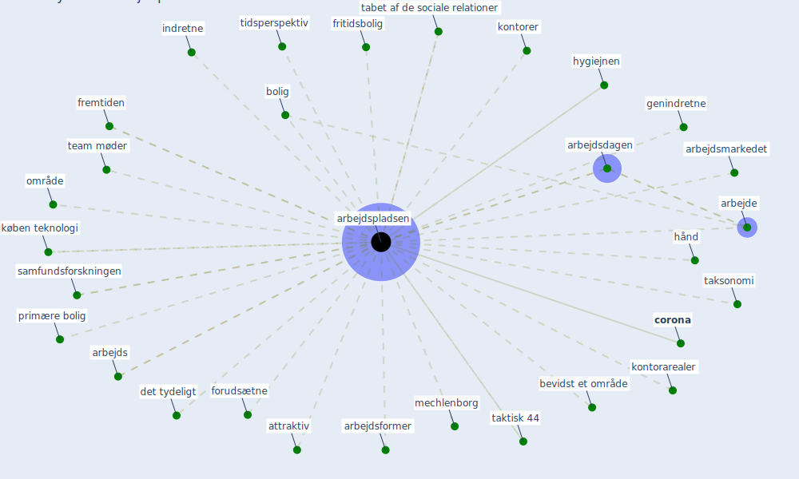

# Keyword: arbejdspladsen

## Keywords

 * arbejde, arbejds, arbejdsdagen, arbejdsformer, arbejdsmarkedet, [arbejdspladsen](keyword_arbejdspladsen), attraktiv, bevidst et område, bolig, [corona](keyword_corona), det tydeligt, effektive på egen hånd, forudsætne, fremtiden, fritidsbolig, genindretne, hygiejnen, hånd, indretne, kontorarealer, kontorer, køben teknologi, mechlenborg, område, primære bolig, samfundsforskningen, tabet af de sociale relationer, taksonomi, taktisk 44, team møder, tidsperspektiv, [transport](keyword_transport)

## Mapping

## Neighbours

### Closest articles

* Refleksioner fra en pandemi - [LINK](article_realdania_refleksioner_2022)
* Pandemiens arkitektur - [LINK](article_realdania_pandemiens_2022)

### Closest BPs

