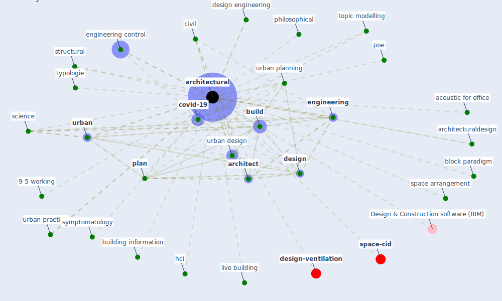

# Keyword: architectural

* [design-ventilation](cluster_2)

* [space-cid](cluster_12)

## Keywords

 * 9 5 working, Cluster_12, Cluster_2, acoustic for office, [architect](keyword_architect), [architectural](keyword_architectural), architecturaldesign, block paradigm, [build](keyword_build), [building](keyword_building), building information, civil, [covid-19](keyword_covid-19), [design](keyword_design), design engineering, [engineering](keyword_engineering), engineering control, furniture, hci, identifie study, lillis hall, live building, mechanical, mordern hospital, open office, philosophical, [plan](keyword_plan), pleasure, poe, public realm, [public space](keyword_public_space), science, space arrangement, structural, symptomatology, [topic modelling](keyword_topic_modelling), typologie, [urban](keyword_urban), urban design, [urban planning](keyword_urban_planning), urban practice

## Mapping

## Neighbours

### Closest articles

* A Review on Building Design as a Biomedical System for Preventing COVID-19 Pandemic - [LINK](article_amran_review_2022)
* Housing Experience in Gated Communities in the Time of Pandemics: Lessons Learned from COVID-19 - [LINK](article_asfour_housing_2022)
* Prophylactic Architecture: Formulating the Concept of Pandemic-Resilient Homes - [LINK](article_elrayies_prophylactic_2022)
* Pandemic stricken cities on lockdown. Where are our planning and design professionals [now, then and into the future]? - [LINK](article_allam_pandemic_2020)
* Biophilic design in architecture and its contributions to health, well-being, and sustainability: A critical review - [LINK](article_zhong_biophilic_2022)
* Indoor Air Quality: Rethinking rules of building design strategies in post-pandemic architecture - [LINK](article_megahed_indoor_2021)
* The Role of Architecture and Urbanism in Preventing Pandemics - [LINK](article_kumar_role_2021)
* Impact of Covid-19 on the built environment - [LINK](article_mahima_impact_2022)
* A critical review of heating, ventilation, and air conditioning (HVAC) systems within the context of a global SARS-CoV-2 epidemic - [LINK](article_elsaid_critical_2021)
* Coronavirus questions that will not go away: interrogating urban and socio-spatial implications of COVID-19 measures - [LINK](article_salama_coronavirus_2020)

### Closest BPs

