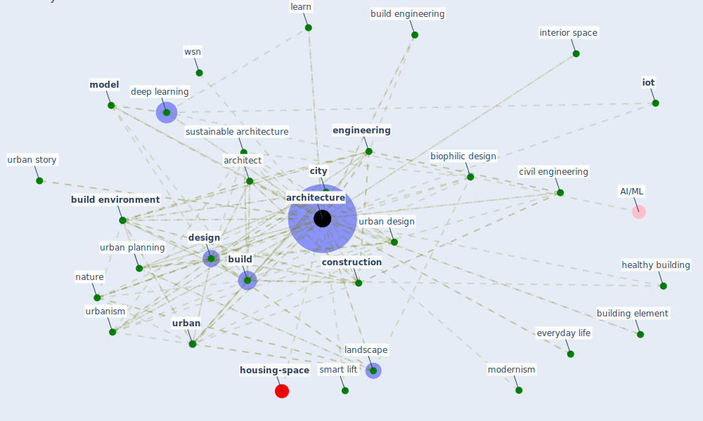

# Keyword: architecture

* [housing-space](cluster_14)

## Keywords

 * 1 healthy housing the current pandemic, [architect](keyword_architect), [architecture](keyword_architecture), architecture approach previously, biomimicry, biophilic architecture, [biophilic design](keyword_biophilic_design), biophilic design framework, [build](keyword_build), build engineering, [build environment](keyword_build_environment), build science, [building](keyword_building), building design, building element, [city](keyword_city), civil engineering, clermont ferrand, [climate](keyword_climate), code of practice, component, configuration, [construction](keyword_construction), [coronavirus](keyword_coronavirus), culture, cure, [deep learning](keyword_deep_learning), [design](keyword_design), design intent, design strategy, discipline, efficientnet b3, [engineering](keyword_engineering), everyday life, firm, fractal, generative space planning, hazard, [health](keyword_health), healthy building, history, [housing](keyword_housing), how, human centric design, hybrid evolutionary technique, [infectious disease](keyword_infectious_disease), interior space, [iot](keyword_iot), keyword architecture, knowledge and resource, landscape, landscape architecture, layer, learn, [light](keyword_light), live space, [model](keyword_model), modern architecture, modern art, modernism, [nature](keyword_nature), nature base design, nature base form, neighbourhood, new architecture, no tall than 500 m, part, pattern, picon, post covid, private space, public realm, [public space](keyword_public_space), [residential](keyword_residential), resilience in architecture, safe navigation service, senior housing, smart lift, [space](keyword_space), space configuration, stress space, [sustainability](keyword_sustainability), [sustainable architecture](keyword_sustainable_architecture), sustainable goal, sustainable sustainable architecture, tape, taxonomy, [technology](keyword_technology), [tool](keyword_tool), two main part, [urban](keyword_urban), urban architecture, urban design, urban design and planning, [urban planning](keyword_urban_planning), urban story, [urbanism](keyword_urbanism), wall, wsn, [yolo](keyword_yolo)

## Mapping

## Neighbours

### Closest articles

* Biophilic design in architecture and its contributions to health, well-being, and sustainability: A critical review - [LINK](article_zhong_biophilic_2022)
* Antivirus-built environment: Lessons learned from Covid-19 pandemic - [LINK](article_megahed_antivirus-built_2020)
* Coronavirus questions that will not go away: interrogating urban and socio-spatial implications of COVID-19 measures - [LINK](article_salama_coronavirus_2020)
* Indoor Air Quality: Rethinking rules of building design strategies in post-pandemic architecture - [LINK](article_megahed_indoor_2021)
* Refleksioner fra en pandemi - [LINK](article_realdania_refleksioner_2022)
* The Role of Architecture and Urbanism in Preventing Pandemics - [LINK](article_kumar_role_2021)
* Designing a Multi-Agent Occupant Simulation System to Support Facility Planning and Analysis for COVID-19 - [LINK](article_lee_designing_2021)
* Adaptive Design of the Built Environment to Mitigate the Transmission Risk of COVID-19 - [LINK](article_ara_dilshad_shangi_adaptive_2020)
* How the Coronavirus Will Reshape Architecture - [LINK](article_chayka_how_2020)
* How is COVID-19 Experience Transforming Sustainability Requirements of Residential Buildings? A Review - [LINK](article_tokazhanov_how_2020)

### Closest BPs

