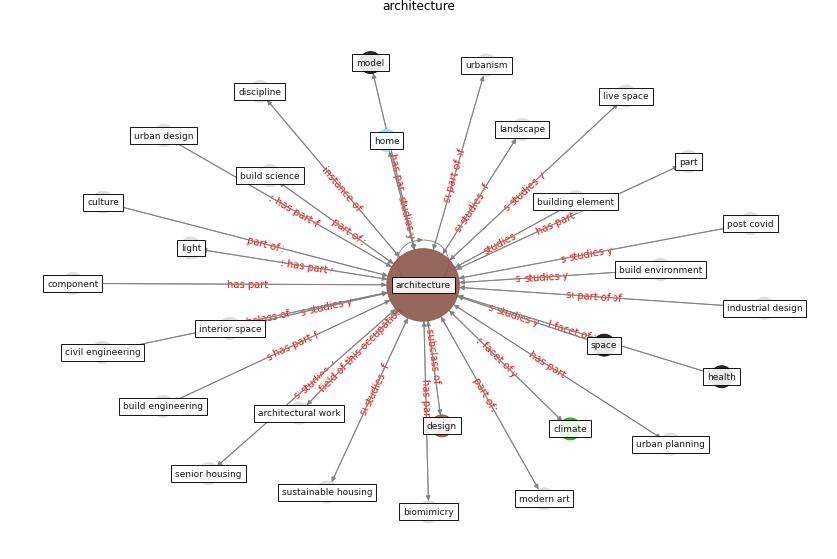

# Keyword: __architecture__
## Clusters

* Cluster 7: [building-space](cluster_7)

## Concepts

 

## Articles
* Antivirus-built environment: Lessons learned from
Covid-19 pandemic ([megahed_antivirus-built_2020](article_megahed_antivirus-built_2020))
* Biophilic design in architecture and its contributions to
health, well-being, and sustainability: A critical
review ([zhong_biophilic_2022](article_zhong_biophilic_2022))
* A Review on Building Design as a Biomedical
System for Preventing COVID-19 Pandemic ([amran_review_2022](article_amran_review_2022))
* Coronavirus questions that will not go away: interrogating
urban and socio-spatial implications of COVID-19
measures ([salama_coronavirus_2020](article_salama_coronavirus_2020))
* Biophilic design in architecture and its contributions to
health, well-being, and sustainability: A critical
review ([zhong_biophilic_2022](article_zhong_biophilic_2022))
* Epidemics, Planning and the City: A Special
Issue of Planning Perspectives ([davis_epidemics_2022](article_davis_epidemics_2022))
* Indoor Air Quality: Rethinking rules of building
design strategies in post-pandemic architecture ([megahed_indoor_2021](article_megahed_indoor_2021))
* COVID19-Routes: A Safe Pedestrian Navigation
Service ([cantarero_covid19-routes_2021](article_cantarero_covid19-routes_2021))
* realdania_refleksioner_2022_EN-450 ([realdania_refleksioner_2022_EN-450](article_realdania_refleksioner_2022_EN-450))
* realdania_refleksioner_2022_EN-200 ([realdania_refleksioner_2022_EN-200](article_realdania_refleksioner_2022_EN-200))
