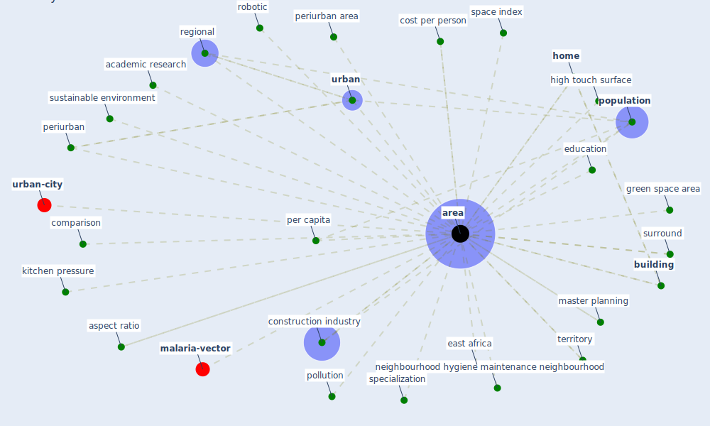

# Keyword: area

* [health-city](cluster_1)

* [space-housing](cluster_4)

* [building-design](cluster_5)

## Keywords

 * 95 confidence interval, Cluster_1, Cluster_4, Cluster_5, academic research, [area](keyword_area), areas, aspect ratio, [building](keyword_building), comparison, [construction industry](keyword_construction_industry), cost per person, [county](keyword_county), county land area, direct sunlight, distribution, east africa, [education](keyword_education), green area, green space area, health and wellness, high touch surface, [home](keyword_home), kitchen pressure, land cover, master planning, [neighborhood](keyword_neighborhood), neighbourhood hygiene maintenance neighbourhood, per capita, periurban, periurban area, [pollution](keyword_pollution), [population](keyword_population), regional, [robotic](keyword_robotic), space index, specialization, surround, sustainable environment, territory, [urban](keyword_urban)

## Mapping

## Neighbours

### Closest articles

* Integrating rapid risk mapping and mobile phone call record data for strategic malaria elimination planning - [LINK](article_tatem_integrating_2014)
* Green spaces, especially forest, linked to lower SARS-CoV-2 infection rates: A one-year nationwide study - [LINK](article_jiang_green_2021)
* COVID-19 Could Leverage a Sustainable Built Environment - [LINK](article_pinheiro_covid-19_2020)
* Adaptive Design of the Built Environment to Mitigate the Transmission Risk of COVID-19 - [LINK](article_ara_dilshad_shangi_adaptive_2020)
* The effect of a redesigned floor plan, occupant density and the quality of indoor climate on the cost of space, productivity and sick leave in an office building–A case study - [LINK](article_saari_effect_2006)
* Strengthening resilience: a priority shared by Health 2020 and - [LINK](article_who_strengthening_2017)
* The Socio-Spatial Determinants of COVID-19 Diffusion: The Impact of Globalisation, Settlement Characteristics and Population - [LINK](article_sigler_socio-spatial_2020)
* Case Study on Finnish TVETA Resilient Model of Training During COVID-19 - [LINK](article_unesco_case_2021)
* DeepSOCIAL: Social Distancing Monitoring and Infection Risk Assessment in COVID-19 Pandemic - [LINK](article_rezaei_deepsocial_2020)

### Closest BPs

