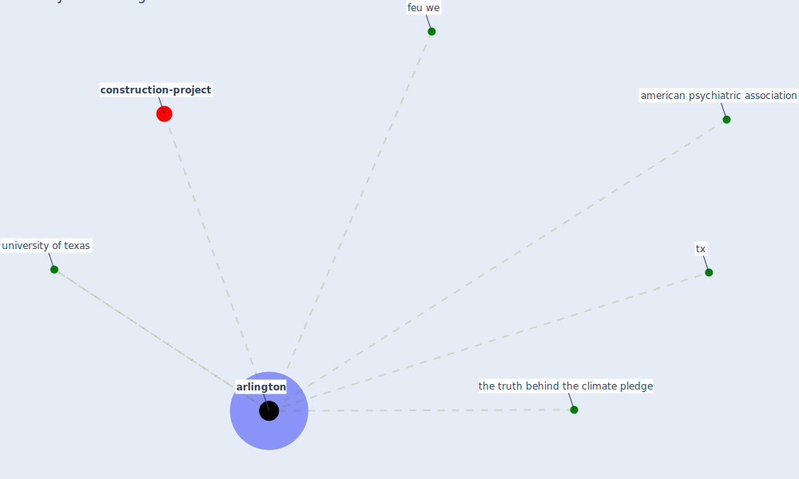

# Keyword: arlington

* [construction-project](cluster_8)

## Keywords

 * Cluster_8, american psychiatric association, [arlington](keyword_arlington), feu we, the truth behind the climate pledge, tx, university of texas

## Mapping

## Neighbours

### Closest articles

* Impacts of COVID-19 on Health and Safety of Workforce in Construction Industry - [LINK](article_pamidimukkala_impacts_2021)
* Urban planning after COVID-19 - [LINK](article_rtpi_urban_2021)
* Strategies to Mitigate COVID-19 Pandemic Impacts on Health and Safety of Workers in Construction Projects - [LINK](article_kaushal_strategies_2021)
* Mental Health and the Covid-19 Pandemic - [LINK](article_pfefferbaum_mental_2020)

### Closest BPs

