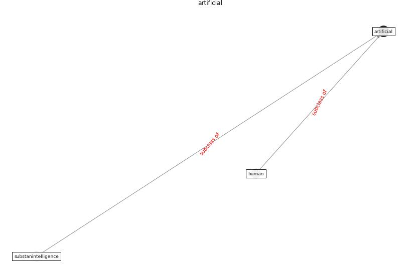

# Keyword: __artificial__
## Clusters

* Cluster 1: [om-ai](cluster_1.md)
* Cluster 10: [fake-medium](cluster_10.md)

## Concepts

 

## Articles
* The socio-economic determinants of COVID-19: A spatial
analysis of German county level data ([ehlert_socio-economic_2021](article_ehlert_socio-economic_2021.md))
* The socio-economic determinants of COVID-19: A spatial
analysis of German county level data ([ehlert_socio-economic_2021](article_ehlert_socio-economic_2021.md))
* COVID-19 and Green Housing: A Review of
Relevant Literature ([kaklauskas_covid-19_2021](article_kaklauskas_covid-19_2021.md))
* The socio-economic determinants of COVID-19: A spatial
analysis of German county level data ([ehlert_socio-economic_2021](article_ehlert_socio-economic_2021.md))
* realdania_refleksioner_2022_EN-1200 ([realdania_refleksioner_2022_EN-1200](article_realdania_refleksioner_2022_EN-1200.md))
* realdania_refleksioner_2022_EN-150 ([realdania_refleksioner_2022_EN-150](article_realdania_refleksioner_2022_EN-150.md))
* realdania_refleksioner_2022_EN-1450 ([realdania_refleksioner_2022_EN-1450](article_realdania_refleksioner_2022_EN-1450.md))
* realdania_refleksioner_2022_EN-1400 ([realdania_refleksioner_2022_EN-1400](article_realdania_refleksioner_2022_EN-1400.md))
* realdania_refleksioner_2022_EN-1350 ([realdania_refleksioner_2022_EN-1350](article_realdania_refleksioner_2022_EN-1350.md))
* realdania_refleksioner_2022_EN-1300 ([realdania_refleksioner_2022_EN-1300](article_realdania_refleksioner_2022_EN-1300.md))
