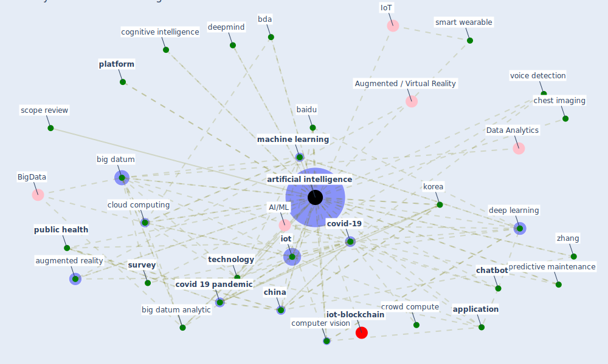

# Keyword: artificial intelligence

* [datum-iot](cluster_4)

## Keywords

 * [5 g](keyword_5_g), [5 g network](keyword_5_g_network), AI/ML, Cluster_4, abu dhabi, advanced control system, ai, ai system, [analytic](keyword_analytic), [application](keyword_application), [artificial intelligence](keyword_artificial_intelligence), augmented reality, baidu, bda, [big datum](keyword_big_datum), big datum analytic, [blockchain](keyword_blockchain), cell phone recording, chatbot, chest imaging, [china](keyword_china), cloud computing, cloudmind, cognitive intelligence, cognitive tool, [computer vision](keyword_computer_vision), [convention 108](keyword_convention_108), [covid 19 pandemic](keyword_covid_19_pandemic), covid 19 pandemic management system, covid 19 screening and diagnosis, [covid-19](keyword_covid-19), [croatia](keyword_croatia), crowd compute, datakalab, datum processing, [deep learning](keyword_deep_learning), deepmind, drug delivery, drug delivery platform, efficiency, [fake news](keyword_fake_news), force cough cell phone recording, group 42, [healthcare](keyword_healthcare), hindu, [image](keyword_image), intelligence, [internet of thing](keyword_internet_of_thing), [iot](keyword_iot), iot base device, knowledge capture, [korea](keyword_korea), landing ai, lunit, machine learning, mobile technology, [model](keyword_model), next generation cellular network, ontario, platform, predictive maintenance, [public health](keyword_public_health), pune institute, repurpose, risk profile, saudi, scope review, slovak republic, [smart city](keyword_smart_city), smart logistic network, smart robot, smart wearable, [south korea](keyword_south_korea), [survey](keyword_survey), [taiwan](keyword_taiwan), [technology](keyword_technology), toscreen, [tuberculosis](keyword_tuberculosis), voice detection, voicebot, white house, zhang

## Mapping

## Neighbours

### Closest articles

* Pandemic Analytics: How Countries are Leveraging Big Data Analytics and Artificial Intelligence to Fight COVID-19? - [LINK](article_mehta_pandemic_2021)
* A Comprehensive Review of the COVID-19 Pandemic and the Role of IoT, Drones, AI, Blockchain, and 5G in Managing its Impact - [LINK](article_chamola_comprehensive_2020)
* How COVID-19 Could Accelerate the Adoption of New Retail Technologies and Enhance the (E-)Servicescape - [LINK](article_willems_how_2021)
* Impact of COVID-19 on IoT Adoption in Healthcare, Smart Homes, Smart Buildings, Smart Cities, Transportation and Industrial IoT - [LINK](article_umair_impact_2021)
* Future (post-COVID) digital, smart and sustainable cities in the wake of 6G: Digital twins, immersive realities and new urban economies - [LINK](article_allam_future_2021)
* Exploring the Potential of Artificial Intelligence and Machine Learning to Combat COVID-19 and Existing Opportunities for LMIC: A Scoping Review - [LINK](article_naseem_exploring_2020)
* Design COVID-19 Ontology: A Healthcare and Safety Perspective - [LINK](article_aloulou_design_2022)
* How the 5G Enabled the COVID-19 Pandemic Prevention and Control: Materiality, Affordance, and (De-)Spatialization - [LINK](article_li_how_2022)
* World Bank Development Report - [LINK](article_world_bank_world_2022)
* Digital technology and COVID-19 - [LINK](article_ting_digital_2020)

### Closest BPs

