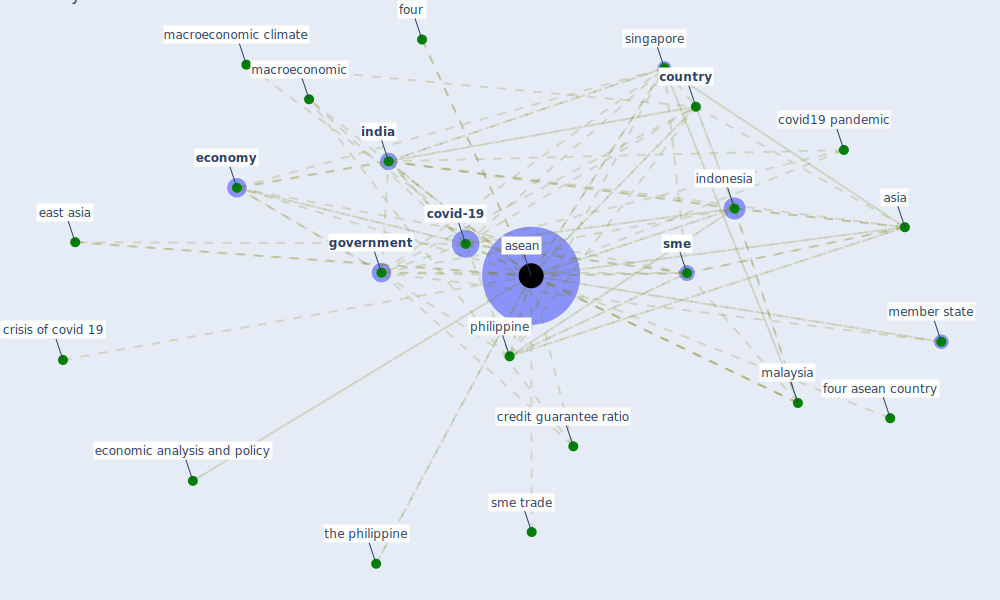

# Keyword: asean

## Keywords

 * [asean](keyword_asean), asia, [country](keyword_country), [covid-19](keyword_covid-19), covid19 pandemic, credit guarantee ratio, crisis of covid 19, east asia, economic analysis and policy, [economy](keyword_economy), four, four asean country, [government](keyword_government), [india](keyword_india), [indonesia](keyword_indonesia), macroeconomic, macroeconomic climate, [malaysia](keyword_malaysia), [member state](keyword_member_state), philippine, singapore, [sme](keyword_sme), sme trade, the philippine

## Mapping

## Neighbours

### Closest articles

* COVID-19 and regional solutions for mitigating the risk of SME finance in selected ASEAN member states - [LINK](article_taghizadeh-hesary_covid-19_2022)
* Global value chains: Efficiency and risks in the context of COVID-19 - [LINK](article_oecd_global_2021)

### Closest BPs

