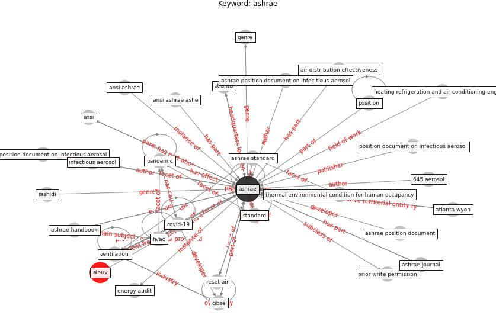

# Keyword: __ashrae__
## Clusters

* Cluster 8: [air-ventilation](cluster_8)

## Concepts

 

## Articles
* ashrae_ashrae_2022-250 ([ashrae_ashrae_2022-250](article_ashrae_ashrae_2022-250))
* hmc_architects_how_2020-150 ([hmc_architects_how_2020-150](article_hmc_architects_how_2020-150))
* ashrae_ashrae_2022-50 ([ashrae_ashrae_2022-50](article_ashrae_ashrae_2022-50))
* ashrae_ashrae_2022-0 ([ashrae_ashrae_2022-0](article_ashrae_ashrae_2022-0))
* ashrae_ashrae_2022-100 ([ashrae_ashrae_2022-100](article_ashrae_ashrae_2022-100))
* The effect of occupant distribution on energy consumption
and COVID-19 infection in buildings: A case study of
university building ([mokhtari_effect_2021](article_mokhtari_effect_2021))
* Ten questions concerning occupant health in buildings
during normal operations and extreme events including the
COVID-19 pandemic ([awada_ten_2021](article_awada_ten_2021))
* world_green_building_council_health_2014-350 ([world_green_building_council_health_2014-350](article_world_green_building_council_health_2014-350))
* ashrae_ashrae_2022-200 ([ashrae_ashrae_2022-200](article_ashrae_ashrae_2022-200))
* Applications of ultraviolet germicidal irradiation
disinfection in health care facilities: Effective
adjunct, but not stand-alone technology ([memarzadeh_applications_2010](article_memarzadeh_applications_2010))
