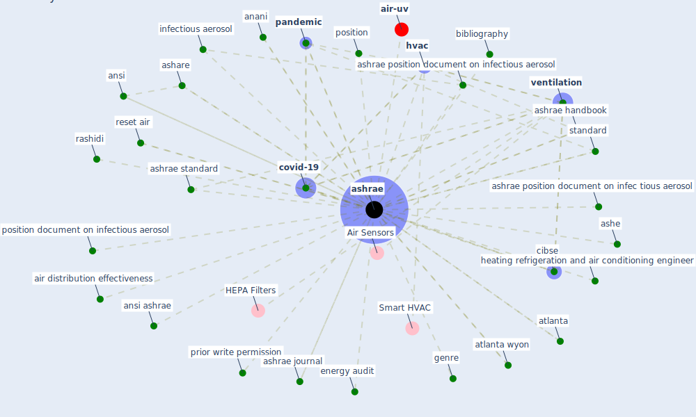

# Keyword: ashrae

* [air-uv](cluster_10)

## Keywords

 * 55 2013 recommend value, 55 2013 recommend value for standard office work, 645 aerosol, Cluster_10, abbreviation, acca, air distribution effectiveness, american, american society of heating refrigerate and air conditioning engineer, anani, ansi, ansi ashrae, ansi ashrae ashe, ansi ashrae standard, ash rae standard 55, ashare, ashe, ashe standard, [ashrae](keyword_ashrae), ashrae 62 1, ashrae epidemic, ashrae epidemic task force, ashrae handbook, ashrae journal, ashrae limit indoor mold and dampness in building, ashrae position document, ashrae position document on infec tious aerosol, ashrae position document on infectious aerosol, ashrae position document on infectious aerosol 17, ashrae position document on infectious aerosol 2, ashrae position document on infectious aerosol 5, ashrae research guideline, ashrae standard, ashrae standard 52, ashrae standard 52 2 2017, ashrae standard 55, ashrae standard 62, ashrae standard 62 1, atlanta, atlanta wyon, bibliography, bsria, building code and standard, [cdc](keyword_cdc), cen tralize conditioning, cen tralize conditioning system, cibse, civid, [covid 19 pandemic](keyword_covid_19_pandemic), covid 19 virus, [covid-19](keyword_covid-19), energy audit, epa, frequently ask question, frequently ask question faq, genre, guidance for build operation during the covid 19 pandemic, heating refrigerate and air conditioning engineer, heating refrigeration and air conditioning engineer, heating ventilation and air conditioning, heating ventilation and air conditioning association, [hvac](keyword_hvac), [indoor air quality](keyword_indoor_air_quality), infectious aerosol, infectiousness of air from a tuberculosis ward ultraviolet irradiation of infect air, influashrae position document on infectious aerosol 4, m v, [pandemic](keyword_pandemic), particulate size, performance measurement, position, position document, position document on airborne in fectious disease, position document on airborne infectious disease, position document on infectious aerosol, prior write permission, proceeding of ashrae iaq, rashidi, rehva, reset air, sanskrit, shase, standa rd 90 1, [standard](keyword_standard), standard 55, standard 62 1 62 2, sun zhai, transaction, transmission of the virus, update its position document on airborne infectious disease, [usa](keyword_usa), [ventilation](keyword_ventilation), ventilation factor

## Mapping

## Neighbours

### Closest articles

* ASHRAE Position Document on Infectious Aerosols - [LINK](article_ashrae_ashrae_2022)
* Review and comparison of HVAC operation guidelines in different countries during the COVID-19 pandemic - [LINK](article_guo_review_2021)
* A critical review of heating, ventilation, and air conditioning (HVAC) systems within the context of a global SARS-CoV-2 epidemic - [LINK](article_elsaid_critical_2021)
* Ten questions concerning occupant health in buildings during normal operations and extreme events including the COVID-19 pandemic - [LINK](article_awada_ten_2021)
* The efficacy of social distance and ventilation effectiveness in preventing COVID-19 transmission - [LINK](article_sun_efficacy_2020)
* Continuous IEQ monitoring system: Context and development - [LINK](article_parkinson_continuous_2019)
* Ventilation use in nonmedical settings during COVID-19: Cleaning protocol, maintenance, and recommendations - [LINK](article_nembhard_ventilation_2020)
* Reflecting on Impacts of COVID19 on Sustainable Buildings and Cities - [LINK](article_gonzalez_reflecting_2021)
* Addressing the impact of COVID-19 lockdown on energy use in municipal buildings: A case study in Florianópolis, Brazil - [LINK](article_geraldi_addressing_2021)
* Scalable IoT Architecture for Monitoring IEQ Conditions in Public and Private Buildings - [LINK](article_calvo_scalable_2022)

### Closest BPs

