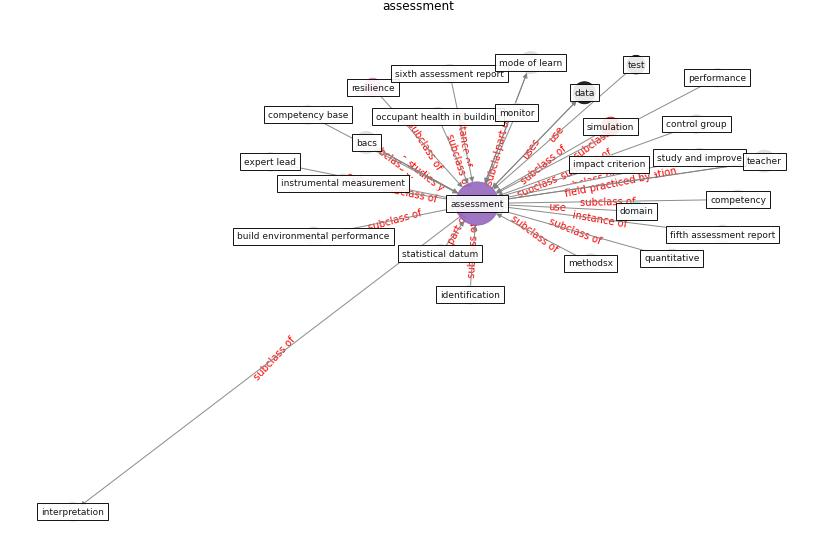

# Keyword: __assessment__
## Clusters

* Cluster 6: [building-guidance](cluster_6)

## Concepts

 

## Articles
* unesco_case_2021 ([unesco_case_2021](article_unesco_case_2021))
* oecd_guidelines_2014 ([oecd_guidelines_2014](article_oecd_guidelines_2014))
* Addressing the impact of COVID-19 lockdown on energy use
in municipal buildings: A case study in Florianópolis,
Brazil ([geraldi_addressing_2021](article_geraldi_addressing_2021))
* Revisiting the built environment: 10 potential development
changes and paradigm shifts due to COVID-19 ([cheshmehzangi_revisiting_2021](article_cheshmehzangi_revisiting_2021))
* Assessment of Building Automation and Control
Systems in Danish Healthcare Facilities in the
COVID-19 Era ([pedersen_assessment_2022](article_pedersen_assessment_2022))
* Ten questions concerning occupant health in buildings
during normal operations and extreme events including the
COVID-19 pandemic ([awada_ten_2021](article_awada_ten_2021))
* eurofund_sustainable_2016 ([eurofund_sustainable_2016](article_eurofund_sustainable_2016))
* Assessment of Building Automation and Control
Systems in Danish Healthcare Facilities in the
COVID-19 Era ([pedersen_assessment_2022](article_pedersen_assessment_2022))
* rtpi_urban_2021-200 ([rtpi_urban_2021-200](article_rtpi_urban_2021-200))
* Assessment of Building Automation and Control
Systems in Danish Healthcare Facilities in the
COVID-19 Era ([pedersen_assessment_2022](article_pedersen_assessment_2022))
