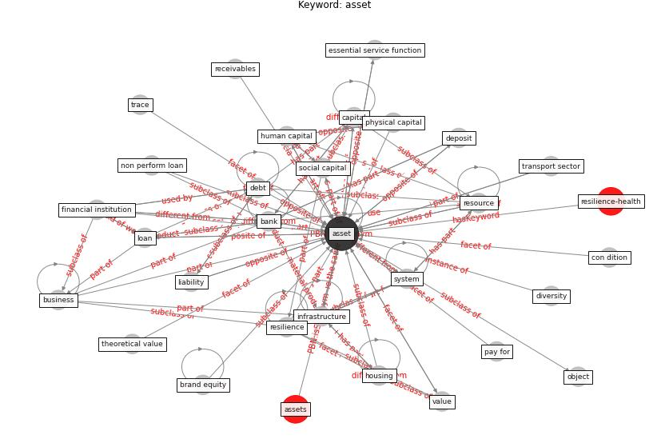

# Keyword: __asset__
## Clusters

* Cluster 14: [resilience-system](cluster_14)

## Concepts

 

## Top 10 articles for __asset__
* COVID-19 and regional solutions for mitigating the risk
of SME finance in selected ASEAN member states ([taghizadeh-hesary_covid-19_2022](article_taghizadeh-hesary_covid-19_2022))
* world_bank_world_2022 ([world_bank_world_2022](article_world_bank_world_2022))
* oecd_guidelines_2014 ([oecd_guidelines_2014](article_oecd_guidelines_2014))
* Dangerous liaisons? Applying the social harm perspective
to the social inequality, housing and health trifecta
during the Covid-19 pandemic ([gurney_dangerous_2021](article_gurney_dangerous_2021))
* who_strengthening_2017 ([who_strengthening_2017](article_who_strengthening_2017))
* How COVID-19 Could Accelerate the Adoption of
New Retail Technologies and Enhance the
(E-)Servicescape ([willems_how_2021](article_willems_how_2021))
* Exploring the Non-Medical impacts of Covid-19 using
Natural Language Processing ([agade_exploring_2020](article_agade_exploring_2020))
* A critical analysis of the impacts of COVID-19 on the
global economy and ecosystems and opportunities for
circular economy strategies ([ibn-mohammed_critical_2021](article_ibn-mohammed_critical_2021))
* world_green_building_council_health_2014 ([world_green_building_council_health_2014](article_world_green_building_council_health_2014))
* oecd_covid-19_2021 ([oecd_covid-19_2021](article_oecd_covid-19_2021))
