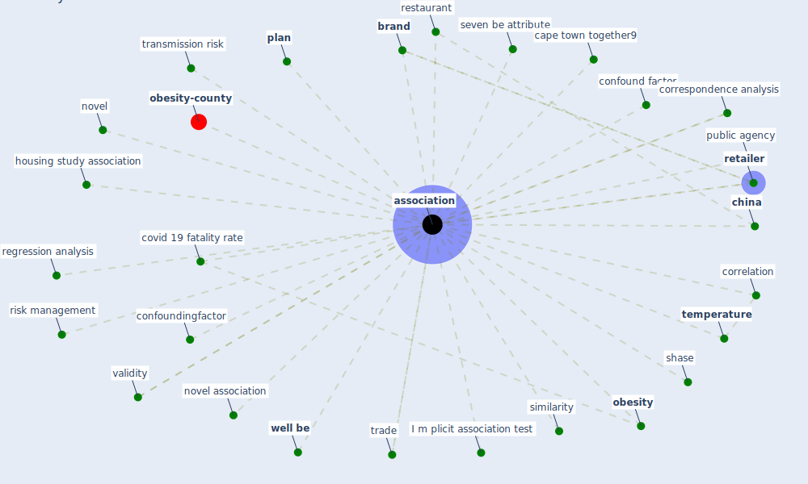

# Keyword: association

* [obesity-county](cluster_9)

## Keywords

 * Cluster_9, I m plicit association test, [association](keyword_association), associations, [brand](keyword_brand), cape town together9, [china](keyword_china), confound factor, confoundingfactor, correlation, correspondence analysis, covid 19 fatality rate, housing study association, novel, novel association, [obesity](keyword_obesity), [plan](keyword_plan), public agency, regression analysis, restaurant, [retailer](keyword_retailer), risk management, seven be attribute, shase, similarity, [temperature](keyword_temperature), trade, transmission risk, validity, [well be](keyword_well_be)

## Mapping

## Neighbours

### Closest articles

* How COVID-19 Could Accelerate the Adoption of New Retail Technologies and Enhance the (E-)Servicescape - [LINK](article_willems_how_2021)
* Green spaces, especially forest, linked to lower SARS-CoV-2 infection rates: A one-year nationwide study - [LINK](article_jiang_green_2021)
* Retail Signage During the COVID-19 Pandemic - [LINK](article_mcneish_retail_2020)
* Validity of energy social research during and after COVID-19: challenges, considerations, and responses - [LINK](article_fell_validity_2020)
* Analysis of COVID-19 Concerns Raised by the Construction Workforce and Development of Mitigation Practices - [LINK](article_bou_hatoum_analysis_2021)
* Treating two pandemics for the price of one: Chronic and infectious disease impacts of the built and natural environment - [LINK](article_frank_treating_2021)
* Startups in times of crisis – A rapid response to the COVID-19 pandemic - [LINK](article_kuckertz_startups_2020)
* What drives unverified information sharing and cyberchondria during the COVID-19 pandemic? - [LINK](article_laato_what_2020)
* Green in times of COVID-19: urban green space relevance during the COVID-19 pandemic in Buenos Aires City - [LINK](article_marconi_green_2022)
* Association of built environment attributes with the spread of COVID-19 at its initial stage in China - [LINK](article_li_association_2021)

### Closest BPs

