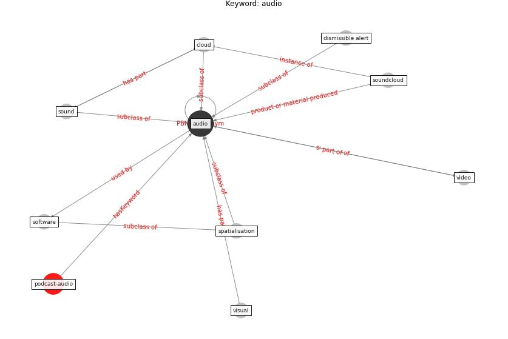

# Keyword: audio

* [podcast-audio](cluster_Cluster_7)

## Keywords

 * Cluster_7, [audio](keyword_audio), cloud, dismissible alert, software, [sound](keyword_sound), soundcloud, spatialisation, video, visual

## Concepts

 

## Neighbours

### Closest articles

* The City Under COVID‐19: Podcasting As Digital Methodology - [LINK](article_rogers_city_2020)
* Emergency Healthcare Facilities: Managing Design in a Post Covid-19 World - [LINK](article_marinelli_emergency_2020)
* Towards the sustainable development of smart cities through mass video surveillance: A response to the COVID-19 pandemic - [LINK](article_shorfuzzaman_towards_2021)

### Closest BPs

