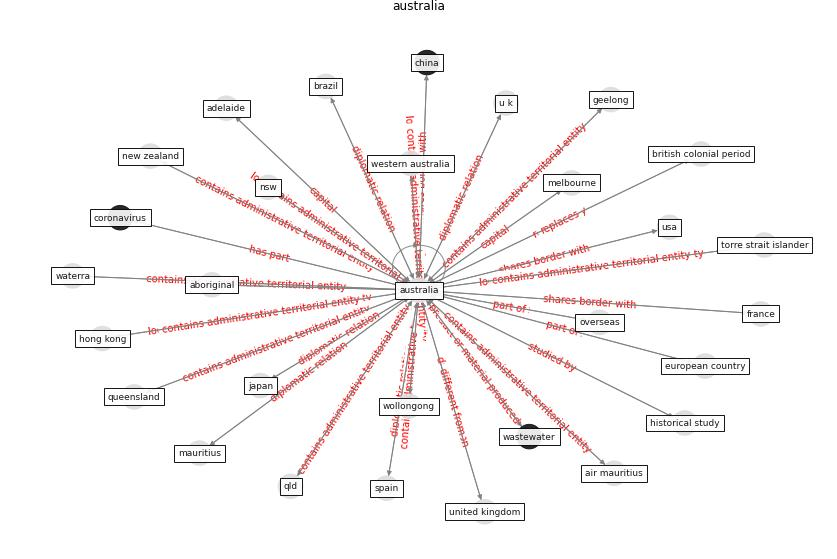

# Keyword: australia

* [podcast-audio](cluster_Cluster_7)

## Keywords

 * aboriginal, adelaide, anglo american economy, australa, [australia](keyword_australia), australian government department of health, [austria](keyword_austria), b h, babbitt, bahrain, brisbane, build occupant survey system australia, [canada](keyword_canada), canberra, charles sturt university, [china](keyword_china), commonwealth, continent, [coronavirus](keyword_coronavirus), [covid 19 pandemic](keyword_covid_19_pandemic), [covid-19](keyword_covid-19), curtin university, european country, fair work act 2009, federal, first nation, first nation people, [france](keyword_france), geelong, [germany](keyword_germany), gig economy, gold coast, [government](keyword_government), government department of health, grattan institute, great australian dream, great britain, greece, hip end roof, [hong kong](keyword_hong_kong), [india](keyword_india), indigenous, indigenous community, indigenous people, [japan](keyword_japan), kato, [korea](keyword_korea), [lockdown](keyword_lockdown), macquarie university, mauritius, medicaljournal, [melbourne](keyword_melbourne), metropolitan region, [netherland](keyword_netherland), new rescue and liquidation process, [new south wale](keyword_new_south_wale), new zealand, nsw, overseas, pandemic influenza in australia, perth, pine, privatisation, property council, public health law, qld, queensland, rmit university, school of architecture design and planning, smart speaker, south, [south africa](keyword_south_africa), south australia, south east, [spain](keyword_spain), st leonard, st leonard nsw, [state](keyword_state), state territory, [sydney](keyword_sydney), tasmania, the us, torre, torre strait islander, [u k](keyword_u_k), [united kingdom](keyword_united_kingdom), [united states](keyword_united_states), university of melbourne, university of queensland, university of south australia, university of sydney, university of technology sydney, university of western australia, [usa](keyword_usa), vic, victoria, [wastewater](keyword_wastewater), waterra, western australia, wollongong

## Concepts

 

## Neighbours

### Closest articles

* The COVID-19 pandemic: Lessons on building more equal and sustainable societies - [LINK](article_van_barneveld_covid-19_2020)
* The City Under COVID‐19: Podcasting As Digital Methodology - [LINK](article_rogers_city_2020)
* Designing for COVID-2x: Reflecting on Future-Proofing Human Habitation for the Inevitable Next Pandemic - [LINK](article_spennemann_designing_2022)
* A review of facilities management interventions to mitigate respiratory infections in existing buildings - [LINK](article_zhang_review_2022)
* Impact of COVID-19 on IoT Adoption in Healthcare, Smart Homes, Smart Buildings, Smart Cities, Transportation and Industrial IoT - [LINK](article_umair_impact_2021)
* Occupant health in buildings: Impact of the COVID-19 pandemic on the opinions of building professionals and implications on research - [LINK](article_awada_occupant_2022)
* First confirmed detection of SARS-CoV-2 in untreated wastewater in Australia: A proof of concept for the wastewater surveillance of COVID-19 in the community - [LINK](article_ahmed_first_2020)
* A Comprehensive Review of the COVID-19 Pandemic and the Role of IoT, Drones, AI, Blockchain, and 5G in Managing its Impact - [LINK](article_chamola_comprehensive_2020)
* Navigating Climate Change: Rethinking the Role of Buildings - [LINK](article_cole_navigating_2020)
* Pandemic stricken cities on lockdown. Where are our planning and design professionals [now, then and into the future]? - [LINK](article_allam_pandemic_2020)

### Closest BPs

