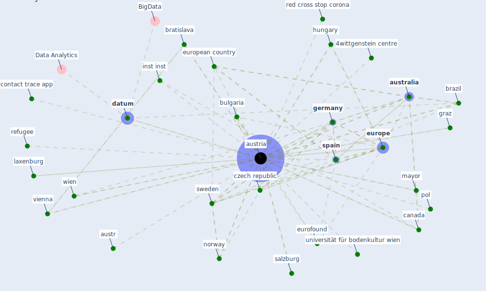

# Keyword: austria

## Keywords

 * 4wittgenstein centre, alda, [argentina](keyword_argentina), austr, [australia](keyword_australia), [austria](keyword_austria), bratislava, [brazil](keyword_brazil), [bulgaria](keyword_bulgaria), [canada](keyword_canada), city of salzburg, city of vienna, contact trace app, czech republic, [datum](keyword_datum), eu member state, [eurofound](keyword_eurofound), [europe](keyword_europe), european, european country, foreign national in austria, german, [germany](keyword_germany), graz, hungary, innsbruck, inst inst, integrationbericht, integrationsbericht, interpol, jubiläumsfond der stadt wien für die universität für bodenkultur wien, laxenburg, mayor, norway, pol, red cross stop corona, refugee, refugee in austria, salzburg, sar cov 2 re infection risk in austria, sba research136, sch, [spain](keyword_spain), [sweden](keyword_sweden), [switzerland](keyword_switzerland), tirol, uber, uber uber, university of applied science, university of apply science tirol, university of graz, university of vienna, universität für bodenkultur wien, [vienna](keyword_vienna), vienna institute of demography, vienna university of economic and business, wien

## Mapping

## Neighbours

### Closest articles

* Urban Green Infrastructure and Green Open Spaces: An Issue of Social Fairness in Times of COVID-19 Crisis - [LINK](article_reinwald_urban_2021)
* What has been the impact of the COVID-19 pandemic on immigrants? An update on recent evidence - [LINK](article_oecd_what_2022)
* 2020 Data Protection Report - [LINK](article_council_of_europe_2020_2020)
* Climate and the spread of COVID-19 - [LINK](article_chen_climate_2021)
*  - [LINK](article_mehtab_alam_role_2021)
* Sustainable work throughout the life course: National policies and strategies, Publications Office of the European Union - [LINK](article_eurofund_sustainable_2016)
* Emergency Healthcare Facilities: Managing Design in a Post Covid-19 World - [LINK](article_marinelli_emergency_2020)
* Borders and Catastrophe: lessons from COVID-19 for the European Green Deal - [LINK](article_klein_borders_2021)
* Covid-19 and asset management in EU: a preliminary assessment of performance and investment styles - [LINK](article_rizvi_covid-19_2020)
* Green spaces, especially forest, linked to lower SARS-CoV-2 infection rates: A one-year nationwide study - [LINK](article_jiang_green_2021)

### Closest BPs

