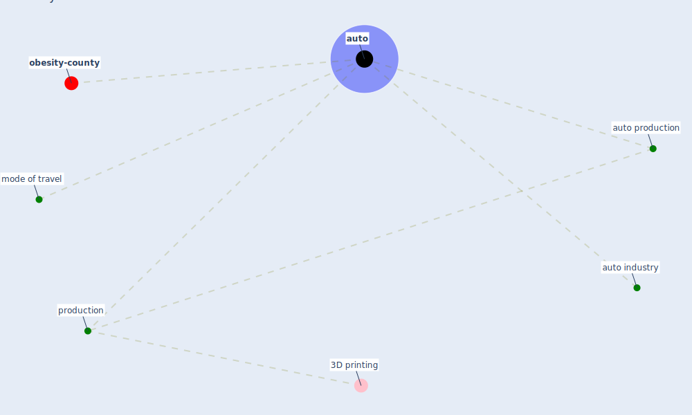

# Keyword: auto

* [obesity-county](cluster_9)

## Keywords

 * Cluster_9, [auto](keyword_auto), auto industry, auto production, mode of travel, production

## Mapping

## Neighbours

### Closest articles

* A Comprehensive Review of the COVID-19 Pandemic and the Role of IoT, Drones, AI, Blockchain, and 5G in Managing its Impact - [LINK](article_chamola_comprehensive_2020)
* Treating two pandemics for the price of one: Chronic and infectious disease impacts of the built and natural environment - [LINK](article_frank_treating_2021)
* Impact of COVID-19 on IoT Adoption in Healthcare, Smart Homes, Smart Buildings, Smart Cities, Transportation and Industrial IoT - [LINK](article_umair_impact_2021)

### Closest BPs

