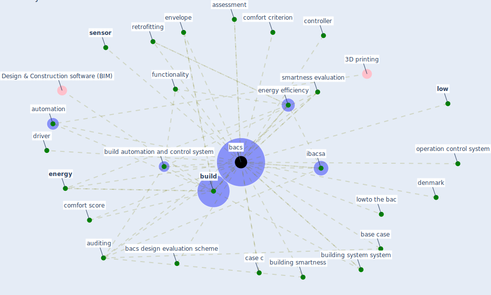

# Keyword: bacs

## Keywords

 * assessment, auditing, automation, [bacs](keyword_bacs), bacs design evaluation scheme, base case, [build](keyword_build), build automation and control system, building smartness, building system system, case c, comfort criterion, comfort score, controller, [denmark](keyword_denmark), driver, [energy](keyword_energy), [energy efficiency](keyword_energy_efficiency), envelope, functionality, [ibacsa](keyword_ibacsa), [low](keyword_low), lowto the bac, operation control system, retrofitting, [sensor](keyword_sensor), smartness evaluation

## Mapping

## Neighbours

### Closest articles

* Assessment of Building Automation and Control Systems in Danish Healthcare Facilities in the COVID-19 Era - [LINK](article_pedersen_assessment_2022)

### Closest BPs

