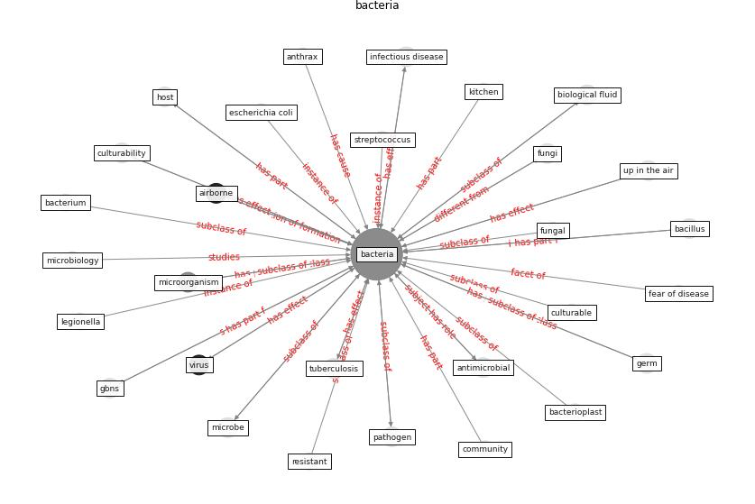

# Keyword: __bacteria__
## Clusters

* Cluster 11: [uvgi-uv](cluster_11)

## Concepts

 

## Articles
* Applications of ultraviolet germicidal irradiation
disinfection in health care facilities: Effective
adjunct, but not stand-alone technology ([memarzadeh_applications_2010](article_memarzadeh_applications_2010))
* Effect of Ultraviolet Germicidal Irradiation on
Viral Aerosols ([walker_effect_2007](article_walker_effect_2007))
* Architectural Design Drives the Biogeography of
Indoor Bacterial Communities ([kembel_architectural_2014](article_kembel_architectural_2014))
* Methods for air cleaning and protection of building
occupants from airborne pathogens ([bolashikov_methods_2009](article_bolashikov_methods_2009))
* Designing Post COVID-19 Buildings: Approaches for
Achieving Healthy Buildings ([navaratnam_designing_2022](article_navaratnam_designing_2022))
* Disinfection technology of hospital wastes and wastewater:
Suggestions for disinfection strategy during coronavirus
Disease 2019 (COVID-19) pandemic in China ([wang_disinfection_2020](article_wang_disinfection_2020))
* ec_views_danish_2020 ([ec_views_danish_2020](article_ec_views_danish_2020))
* Graphene-based nanomaterials as antimicrobial surface
coatings: A parallel approach to restrain the expansion
of COVID-19 ([ayub_graphene-based_2021](article_ayub_graphene-based_2021))
* Assessment of Building Automation and Control
Systems in Danish Healthcare Facilities in the
COVID-19 Era ([pedersen_assessment_2022](article_pedersen_assessment_2022))
* A Review on Building Design as a Biomedical
System for Preventing COVID-19 Pandemic ([amran_review_2022](article_amran_review_2022))
