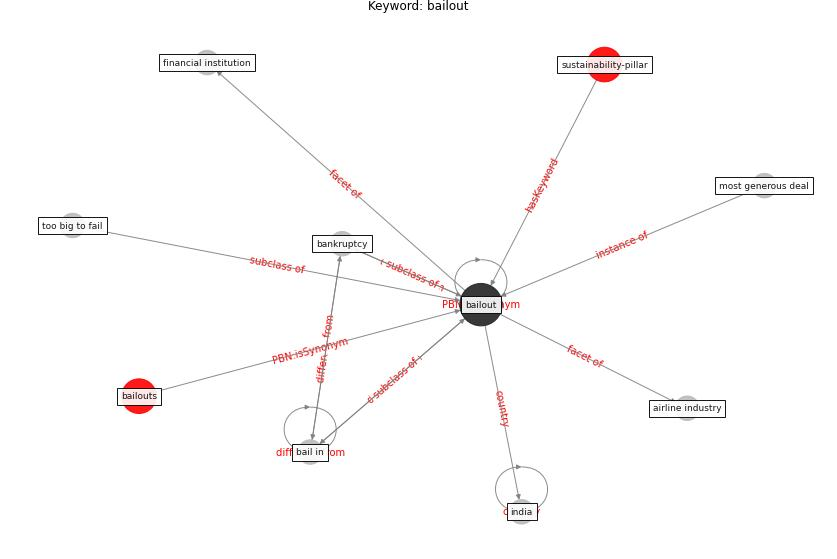

# Keyword: bailout

* [sustainability-pillar](cluster_Cluster_0)

## Keywords

 * Cluster_0, airline industry, bail in, [bailout](keyword_bailout), bailouts, bankruptcy, financial institution, [india](keyword_india), most generous deal, too big to fail

## Concepts

 

## Neighbours

### Closest articles

* World Bank Development Report - [LINK](article_world_bank_world_2022)
* Urban planning after COVID-19 - [LINK](article_rtpi_urban_2021)
* How COVID-19 Redefines the Concept of Sustainability - [LINK](article_hakovirta_how_2020)

### Closest BPs

