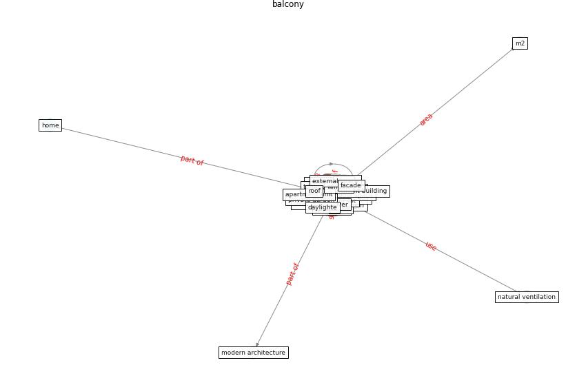

# Keyword: __balcony__
## Clusters

* Cluster 8: [building-space](cluster_8)

## Concepts

 

## Articles
* Questioning the use of the balcony in apartments during
the COVID-19 pandemic process ([aydin_questioning_2020](article_aydin_questioning_2020))
* Prophylactic Architecture: Formulating the Concept
of Pandemic-Resilient Homes ([elrayies_prophylactic_2022](article_elrayies_prophylactic_2022))
* How our homes impact our health: using a COVID-19
informed approach to examine urban apartment housing ([peters_how_2020](article_peters_how_2020))
* COVID-19 Could Leverage a Sustainable Built
Environment ([pinheiro_covid-19_2020](article_pinheiro_covid-19_2020))
* realdania_refleksioner_2022_EN ([realdania_refleksioner_2022_EN](article_realdania_refleksioner_2022_EN))
* Readiness Assessment of Green Building
Certification Systems for Residential Buildings
during Pandemics ([tleuken_readiness_2021](article_tleuken_readiness_2021))
* A Mixed Approach on Resilience of Spanish
Dwellings and Households during COVID-19 Lockdown ([cuerdo-vilches_mixed_2020](article_cuerdo-vilches_mixed_2020))
* Assessment method for new sustainability indicators
providing pandemic resilience for residential buildings ([tokazhanov_assessment_2021](article_tokazhanov_assessment_2021))
* How is COVID-19 Experience Transforming
Sustainability Requirements of Residential
Buildings? A Review ([tokazhanov_how_2020](article_tokazhanov_how_2020))
* COVID-19 and Living space challenge. Well-being and
Public Health recommendations for a healthy, safe, and
sustainable housing. ([dalessandro_covid-19_2020](article_dalessandro_covid-19_2020))
