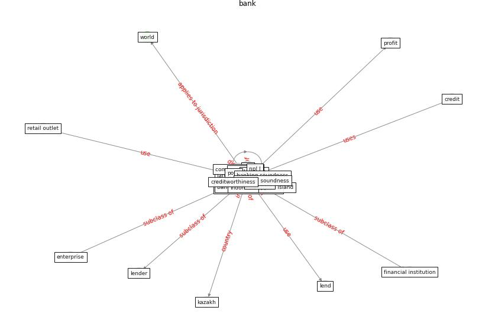

# Keyword: __bank__
## Clusters

* Cluster 4: [resilience-health](cluster_4)

## Concepts

 

## Top 10 articles for __bank__
* world_bank_world_2022 ([world_bank_world_2022](article_world_bank_world_2022))
* COVID-19 and regional solutions for mitigating the risk
of SME finance in selected ASEAN member states ([taghizadeh-hesary_covid-19_2022](article_taghizadeh-hesary_covid-19_2022))
* How COVID-19 Could Accelerate the Adoption of
New Retail Technologies and Enhance the
(E-)Servicescape ([willems_how_2021](article_willems_how_2021))
* Supporting Technologies for COVID-19 Prevention:
Systemized Review ([zhao_supporting_2022](article_zhao_supporting_2022))
* The socio-economic implications of the coronavirus
pandemic (COVID-19): A review ([nicola_socio-economic_2020](article_nicola_socio-economic_2020))
* COVID-19 media fatigue: predictors of decreasing
interest and avoidance of COVID-19–related news ([buneviciene_covid-19_2021](article_buneviciene_covid-19_2021))
* world_green_building_council_health_2014 ([world_green_building_council_health_2014](article_world_green_building_council_health_2014))
* COVID-ABS: An agent-based model of COVID-19
epidemic to simulate health and economic effects of social
distancing interventions ([silva_covid-abs_2020](article_silva_covid-abs_2020))
* COVID-19 Experience Transforming the Protective
Environment of Office Buildings and Spaces ([phapant_covid-19_2021](article_phapant_covid-19_2021))
* COVID-19 and Green Housing: A Review of
Relevant Literature ([kaklauskas_covid-19_2021](article_kaklauskas_covid-19_2021))
